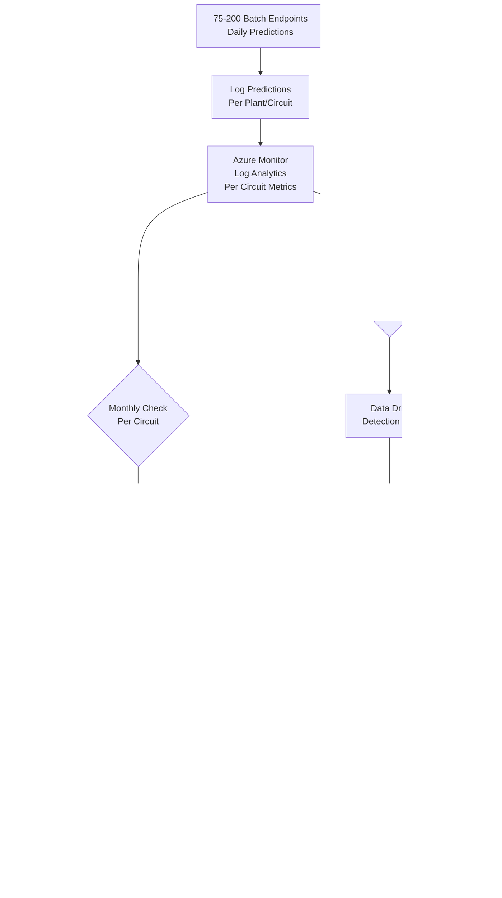

# Azure MLOps Architecture Design Document
**Project:** Time Series Forecasting with TensorFlow  
**Date:** December 9, 2025  
**Architecture Type:** Multi-Model Batch Inference MLOps Pipeline  

---

## Executive Summary

This document outlines a production-ready Azure Machine Learning (AzureML) MLOps architecture for time series forecasting using TensorFlow. The solution manages **75-200 models** (5-10 sensor circuits per plant × 15-20 plants) with PR-based training workflows and multi-stage release pipelines.

**Key Features:**
- **Scale:** 75-200 independent models (one per sensor circuit)
- **Architecture:** One batch endpoint per plant, with deployments per circuit
- **Training Trigger:** Git PR-based workflow with config file change detection
- **Deployment Strategy:** Azure DevOps Releases with 3-stage promotion (Registry → Test → Prod)
- **Approval Gates:** Manual ML Engineer approval for registry promotion and production deployment
- **Environments:** Dev Workspace (training), Shared Azure ML Registry, Test Workspace (validation), Production Workspace
- **Data Engineering:** Azure Synapse Analytics Spark Pool for ETL (every 3 hours), ADLS Gen2 Delta Lake (merge mode, no partitioning)
- **Data Strategy:** Hybrid approach - MLTable Data Assets with cutoff date filter for training reproducibility, direct Delta reads for daily inference
- **Config Management:** Static YAML configs with cutoff dates, hyperparameters per circuit
- **ML Training:** AzureML Compute Clusters (CPU, auto-scaling 0-4 nodes), parallel training (maxParallel=5)
- **CI/CD:** Azure DevOps Build Pipelines (training) + Release Pipelines (deployment with approval gates)
- **Rollback:** Redeploy previous successful release from Azure DevOps history
- **Monitoring:** Monthly model performance monitoring, quarterly data drift detection

---

## 1. High-Level Architecture Diagram


---

## 2. Azure Resources & SKUs

### 2.1 Core Resources (Multi-Environment Setup)

| Resource | SKU/Configuration | Purpose | Cost Optimization |
|----------|------------------|---------|-------------------|
| **Azure ML Registry** | Enterprise | Shared model registry across environments | Single registry for all stages |
| **Dev ML Workspace** | Enterprise Edition | Training and experimentation | Can be in separate subscription |
| **Test ML Workspace** | Enterprise Edition | Integration testing and validation | Same subscription as prod |
| **Production ML Workspace** | Enterprise Edition | Production inference | Same subscription as test |
| **Production ADLS Gen2** | Standard LRS | Data lake (all workspaces read from here) | Lifecycle management for old data |
| **Dev/Test/Prod Workspace Storage** | Standard LRS | Output predictions per workspace | Separate storage per workspace |
| **Azure Synapse Analytics Workspace** | - | ETL orchestration | - |
| **Synapse Spark Pool** | Small (4 vCores, 32GB RAM) | ETL processing | Auto-pause after 5 min idle |
| **Synapse Dedicated SQL Pool** | DW100c (paused when not in use) | Source data tables | Pause when not querying |
| **Dev Compute Cluster** | Standard_DS3_v2 (4 vCPU, 14GB RAM) | Training compute | Auto-scale 0→4 nodes, low priority option |
| **Test Compute Cluster** | Standard_DS2_v2 (2 vCPU, 7GB RAM) | Test inference compute | Smaller cluster, on-demand |
| **Prod Compute Cluster** | Standard_DS3_v2 (4 vCPU, 14GB RAM) | Production inference compute | Auto-scale based on load |
| **Azure Container Registry** | Basic tier | Custom Docker images (shared) | - |
| **Application Insights** | Standard (per workspace) | Logging and monitoring | 5GB free tier/month per workspace |
| **Azure Key Vault** | Standard | Secrets management | - |

### 2.2 Networking Configuration

| Component | Configuration | Rationale |
|-----------|--------------|-----------|
| **Network Isolation** | Public access enabled | Cost-effective for non-sensitive workloads |
| **Firewall Rules** | IP whitelisting for Azure DevOps agents | Restrict access to known IPs |
| **Managed Identity** | System-assigned for AzureML, Synapse | Passwordless authentication |
| **RBAC** | Least-privilege access model | Security best practice |

### 2.3 Storage Layout (Multi-Workspace)

**Production ADLS Gen2 (Shared - All workspaces read input data):**
```
/production-datalake
├── /raw                    # Raw parquet files from sources
├── /processed              # Delta Lake table (merge/upsert mode, no partitions)
│   └── /sensor_data        # Single Delta table with date column
│       ├── *.parquet       # Data files
│       └── _delta_log/     # Transaction log
└── /monitoring             # Drift detection data per circuit
    ├── /plant_1_circuit_1/
    └── /plant_N_circuit_X/
```

**Dev Workspace Storage:**
```
/dev-workspace-storage
├── /mltables               # MLTable definitions for training
│   └── /plant_{id}_circuit_{id}_cutoff_{date}/
├── /models                 # Trained model artifacts
└── /experiments            # MLflow experiment data
```

**Test Workspace Storage:**
```
/test-workspace-storage
├── /predictions            # Test inference outputs
│   ├── /plant_1/
│   │   ├── /circuit_1/test_run_{timestamp}.parquet
│   │   └── /circuit_2/test_run_{timestamp}.parquet
│   └── /plant_N/
└── /test_results           # Validation results
```

**Production Workspace Storage:**
```
/prod-workspace-storage
└── /predictions            # Production batch inference outputs
    ├── /plant_1/
    │   ├── /circuit_1/YYYY-MM-DD.parquet
    │   └── /circuit_2/YYYY-MM-DD.parquet
    ├── /plant_2/
    └── /plant_N/
```

### 2.4 Azure ML Asset Versioning Rules

**Important:** Azure ML has different versioning rules per asset type:

| Asset Type | Versioning Rule | Example Allowed | Example Failed |
|------------|----------------|-----------------|----------------|
| **Model** | Integer ONLY | `1`, `2`, `15` | `1.0.0`, `v1` |
| **Environment** | String | `1.0.0`, `ubuntu-20.04` | N/A (all strings accepted) |
| **Data** | String | `initial_load`, `2025-01-01` | N/A (all strings accepted) |
| **Component** | String | `1.0.0`, `beta` | N/A (all strings accepted) |

**This Architecture Uses:**
- **Models:** Integer versions (Azure ML auto-increment)
- **Environments:** Semantic versioning strings (e.g., `1.5.0`, `2.0.0`)
- **Data Assets (MLTable):** Date-based strings (e.g., `2025-12-09`)
- **Components:** Not used in this architecture

### 2.5 Multi-Model Architecture

**Scale:** 75-200 models (5-10 circuits per plant × 15-20 plants)

#### Model Organization

| Component | Structure | Example |
|-----------|-----------|----------|
| **Config Files** | `config/plants/{plant_id}/{circuit_id}.yml` | `config/plants/P001/C001.yml` |
| **Master Config** | `config/plants_circuits.yml` | Lists all plant-circuit combinations |
| **Batch Endpoints** | One per plant | `batch-endpoint-plant-P001` (15-20 total) |
| **Deployments** | One per circuit within plant | `deployment-circuit-C001` (5-10 per endpoint) |
| **Model Registry** | Tagged by plant + circuit | `sensor-model` with tags `plant_id=P001, circuit_id=C001` |
| **MLflow Experiments** | One per circuit | `plant_P001_circuit_C001` (75-200 experiments) |

#### Config File Structure

**Master Config (`config/plants_circuits.yml`):**
```yaml
plants:
  - plant_id: "P001"
    plant_name: "Manufacturing Plant 1"
    circuits:
      - circuit_id: "C001"
        circuit_name: "Assembly Line A Sensor"
      - circuit_id: "C002"
        circuit_name: "Packaging Line B Sensor"
  
  - plant_id: "P002"
    plant_name: "Distribution Center 2"
    circuits:
      - circuit_id: "C001"
        circuit_name: "Conveyor Belt Sensor"
```

**Per-Circuit Config (`config/plants/P001/C001.yml`):**
```yaml
plant_id: "P001"
circuit_id: "C001"
training:
  cutoff_date: "2025-12-09"     # Drives both PR and manual training
  environment_version: "1.5.0"  # Fixed environment version (semantic versioning)
  hyperparameters:
    sequence_length: 24
    lstm_units: 128
    dropout: 0.2
    learning_rate: 0.001
    batch_size: 32
    epochs: 50
  data_filters:
    sensor_id: "SENSOR_P001_C001"
    feature_columns: ["temperature", "pressure", "vibration"]
deployment:
  compute_instance_type: "Standard_DS3_v2"
  mini_batch_size: 100
```

### 2.6 Environment Management Strategy

**Custom Environment:** Source code package registered as Azure ML Environment with semantic versioning

#### Environment Versioning

**Azure ML Environment Versioning:** Supports **string versions** (e.g., "1.0.0", "ubuntu-20.04", "v2.1")

```python
# Environment registration with semantic versioning
from azure.ai.ml.entities import Environment

env = Environment(
    name="custom-tf-env",
    version="1.5.0",  # String version - semantic versioning recommended
    image="mcr.microsoft.com/azureml/openmpi4.1.0-ubuntu20.04",
    conda_file="environment/conda.yml",
    tags={
        "backward_compatible": "true",    # or "false" for breaking changes
        "requires_retrain": "false",      # or "true" if models need retraining
        "tensorflow_version": "2.13.0",
        "registered_at": "2025-12-09T10:30:00Z",
        "git_commit_sha": "a1b2c3d4",
        "breaking_changes": "",           # Description if breaking
        "change_summary": "Bug fix in scoring script logging"
    },
    description="Custom TensorFlow environment for sensor predictions"
)
```

**Versioning Strategy:**
- Use **semantic versioning** (MAJOR.MINOR.PATCH)
- MAJOR: Breaking changes (e.g., 1.5.0 → 2.0.0)
- MINOR: Non-breaking features (e.g., 1.5.0 → 1.6.0)
- PATCH: Bug fixes (e.g., 1.5.0 → 1.5.1)

#### Environment Change Scenarios

**Scenario 1: Breaking Changes (Requires Model Retraining)**

Examples: TensorFlow version upgrade, feature engineering logic change, preprocessing change

```yaml
# Environment version: 1.5.0 → 2.0.0 (MAJOR bump)
# Tags: backward_compatible: false, requires_retrain: true
```

**Workflow:**
1. Update source code + environment definition (bump MAJOR version: 2.0.0)
2. Update all circuit configs (set `environment_version: "2.0.0"`)
3. Create PR (triggers training for all affected circuits)
4. Models trained with new environment
5. Follow normal Release Pipeline (model + environment promoted together)
6. Production updated gradually (one-by-one approvals per circuit)

**Scenario 2: Non-Breaking Changes (No Model Retraining)**

Examples: Bug fix in scoring script, logging improvements, performance optimization

```yaml
# Environment version: 1.5.0 → 1.5.1 (PATCH bump) or 1.6.0 (MINOR bump)
# Tags: backward_compatible: true, requires_retrain: false
```

**Workflow:**
1. Update source code + environment definition
2. Build new environment version
3. Separate Environment-Only Release Pipeline
4. Test against ALL 75-200 existing models
5. Update all deployments at once (if tests pass)
6. Rollback all if issues occur

---

## 3. Data Strategy - Hybrid Approach

### 3.1 Delta Lake Table Design

**Single Delta Table:** `/processed/sensor_data/` (merge/upsert mode, no partitioning)

| Aspect | Implementation |
|--------|----------------|
| **Schema** | `timestamp` (datetime), `sensor_id` (string), `features` (numeric columns), `date` (date column for filtering) |
| **Write Mode** | Merge/Upsert (daily ETL inserts new date rows, upserts for idempotency) |
| **Merge Keys** | Typically `sensor_id` + `timestamp` or composite key |
| **Partitioning** | None (data not huge, simplifies management) |
| **Data Immutability** | **Historical data never changes** - once a date passes, that data is immutable |
| **Delta Versioning** | Delta transaction log tracks all changes (new dates appended daily) |
| **Data Retention** | Keep all historical data (Delta supports time travel) |

### 3.2 Data Immutability Guarantee

**Critical Assumption:** Historical data for past dates never changes.

```
Day 1 (2025-12-09):
  Delta contains: [2025-01-01 to 2025-12-09] = 100 rows

Day 5 (2025-12-13):
  Delta contains: [2025-01-01 to 2025-12-13] = 120 rows
  BUT data for [2025-01-01 to 2025-12-09] = STILL 100 rows (unchanged)
```

**Why this matters:**
- MLTable with filter `date <= 2025-12-09` always returns same data
- No need to lock Delta table version
- Training reproducibility guaranteed by date filter, not version lock

### 3.3 Training vs. Inference Data Access

#### **Training (Infrequent):**

**Azure ML Data Asset Versioning (Per Circuit):**
- ✅ Versions are **auto-incrementing integers** (1, 2, 3...)
- ✅ Versions are **immutable** (cannot overwrite)
- ✅ **Tags** track metadata (plant_id, circuit_id, cutoff_date, pr_number, etc.)
- ✅ Separate Data Assets per circuit (e.g., `sensor_training_data_P001_C001`)

```python
# Create MLTable with date filter
mltable_yaml = f"""
type: mltable
paths:
  - folder: azureml://datastores/workspaceblobstore/paths/processed/sensor_data/
transformations:
  - read_delta_lake:
      delta_table_version: latest  # Safe because historical data is immutable
  - filter:
      expression: "date <= '{cutoff_date}'"  # Training cutoff date
"""

# Register as Data Asset (version auto-assigned)
from azure.ai.ml.entities import Data

# Unique name per circuit
data_asset_name = f"sensor_training_data_{plant_id}_{circuit_id}"

# Check if cutoff_date already exists for this circuit
all_versions = ml_client.data.list(name=data_asset_name)
for asset in all_versions:
    if asset.tags.get("cutoff_date") == cutoff_date:
        print(f"Found existing version {asset.version}")
        return f"{data_asset_name}:{asset.version}"

# Not found, register new version
data_asset = Data(
    name=data_asset_name,
    # NO version specified - auto-incremented by Azure ML
    type="mltable",
    path=f"azureml://datastores/workspaceblobstore/paths/mltables/plant_{plant_id}_circuit_{circuit_id}_cutoff_{cutoff_date}/",
    tags={
        "plant_id": plant_id,           # e.g., "P001"
        "circuit_id": circuit_id,       # e.g., "C001"
        "cutoff_date": cutoff_date,     # e.g., "2025-12-09"
        "pr_number": pr_number,         # e.g., "PR-1234"
        "pr_author": pr_author,         # e.g., "john.doe@company.com"
        "git_commit_sha": git_sha,      # e.g., "a1b2c3d4"
        "delta_path": "/processed/sensor_data/",
        "registered_at": datetime.now().isoformat()
    },
    description=f"Training data for Plant {plant_id} Circuit {circuit_id} up to {cutoff_date}"
)
registered = ml_client.data.create_or_update(data_asset)
print(f"Registered as version {registered.version}")  # e.g., "2"
```

**Example Data Asset Registry (Multi-Model):**
```
sensor_training_data_P001_C001:1  →  {"plant_id": "P001", "circuit_id": "C001", "cutoff_date": "2025-11-09"}
sensor_training_data_P001_C001:2  →  {"plant_id": "P001", "circuit_id": "C001", "cutoff_date": "2025-12-09"}
sensor_training_data_P001_C002:1  →  {"plant_id": "P001", "circuit_id": "C002", "cutoff_date": "2025-12-09"}
sensor_training_data_P002_C001:1  →  {"plant_id": "P002", "circuit_id": "C001", "cutoff_date": "2025-12-09"}
```

**Benefits:**
- ✅ Reproducible training (date filter + data immutability)
- ✅ No daily overhead (only register when training)
- ✅ Clear lineage (Data Asset v2 → Model v1)
- ✅ No duplicate registrations (check tags first)
- ✅ MLTable is a logical view (no data duplication)

#### **Inference (Daily - Per Circuit):**
```python
# In score.py - Direct Delta read for specific circuit
import pandas as pd
from deltalake import DeltaTable
import os

# Get circuit info from environment (passed during batch invocation)
plant_id = os.environ.get("PLANT_ID")      # e.g., "P001"
circuit_id = os.environ.get("CIRCUIT_ID")  # e.g., "C001"
sensor_id = f"SENSOR_{plant_id}_{circuit_id}"

# Read latest data from Delta
delta_path = "/mnt/batch/processed/sensor_data/"
delta_table = DeltaTable(delta_path)
df = delta_table.to_pandas()

# Filter for this circuit's sensor
df_circuit = df[df['sensor_id'] == sensor_id]
latest_date = df_circuit['date'].max()
df_latest = df_circuit[df_circuit['date'] == latest_date]
```

**Benefits:**
- ✅ No MLTable registration overhead
- ✅ Always reads freshest data
- ✅ Simple and performant

### 3.4 Data Lineage & Governance

| Component | Tracking Method |
|-----------|----------------|
| **ETL Runs** | Synapse pipeline run ID + Delta commit timestamp |
| **Training Data** | MLTable Data Asset version (integer) + cutoff_date tag |
| **Model Lineage** | Model metadata links to Data Asset version number |
| **Inference Data** | Delta version read logged in Application Insights |

### 3.5 Two-Stage Training Approach (Graphical Lineage - Multi-Model)

**Challenge:** AzureML requires Data Asset as pipeline input for graphical lineage, but version number is unknown until registration.

**Solution:** Two-stage Azure DevOps pipeline with parallel execution:

```
Git PR Merged:
  └─ Git diff detects changed config files
     └─ Example: 3 circuits changed (P001/C001, P001/C002, P002/C001)

Stage 1 (PrepareData - Parallel maxParallel=5):
  ├─ Job 1: Register MLTable for P001/C001 (cutoff_date from config)
  │  └─ Returns: sensor_training_data_P001_C001:5
  ├─ Job 2: Register MLTable for P001/C002
  │  └─ Returns: sensor_training_data_P001_C002:3
  └─ Job 3: Register MLTable for P002/C001
     └─ Returns: sensor_training_data_P002_C001:2
     
Stage 2 (Train - Parallel maxParallel=5):
  ├─ Job 1: Train P001/C001 with Data Asset:5
  │  └─ Register model: sensor_model (tags: plant_id=P001, circuit_id=C001, version=1.5)
  ├─ Job 2: Train P001/C002 with Data Asset:3
  │  └─ Register model: sensor_model (tags: plant_id=P001, circuit_id=C002, version=2.1)
  └─ Job 3: Train P002/C001 with Data Asset:2
     └─ Register model: sensor_model (tags: plant_id=P002, circuit_id=C001, version=1.0)
     
AzureML Studio:
  └─ Graphical lineage per circuit:
     ├─ Data Asset sensor_training_data_P001_C001:5 → Model sensor_model (P001/C001) v1.5
     ├─ Data Asset sensor_training_data_P001_C002:3 → Model sensor_model (P001/C002) v2.1
     └─ Data Asset sensor_training_data_P002_C001:2 → Model sensor_model (P002/C001) v1.0
```

**Benefits:**
- ✅ Full graphical lineage per circuit in AzureML Studio
- ✅ Parallel training for efficiency (maxParallel=5 prevents resource exhaustion)
- ✅ Config-driven cutoff dates (same config for PR and manual training)
- ✅ Check-if-exists logic prevents duplicate Data Asset registrations
- ✅ Model registry tagged by plant_id, circuit_id for easy filtering
- ✅ Training only registers models (no auto-deployment)

---

## 4. CI/CD Pipeline Architecture (Azure DevOps)

### 4.1 Pipeline Overview


    J --> L[Deploy Pipeline<br/>Blue-Green]
    L --> M[Update Batch<br/>Endpoint]
```
    F --> G[Training Pipeline<br/>with MLTable Registration]
    G --> H[Model Evaluation]
    H --> I{Meets<br/>Threshold?}
    I -->|Yes| J[Register Model<br/>to Registry]
    I -->|No| K[Alert Data Scientists]
    J --> L[Deploy Pipeline<br/>Blue-Green]
    L --> M[Update Batch<br/>Endpoint]
```

### 4.2 Build Pipeline - Training (PR-Based)

**Trigger:** Pull Request merged to main branch with config file changes  
**Output:** Artifact with trained model metadata for Release Pipeline

```yaml
# azure-pipelines-build-training.yml
trigger:
  branches:
    include:
      - main
  paths:
    include:
      - config/plants/**/*.yml  # Trigger only on config changes

variables:
  - name: maxParallelTraining
    value: 5  # Limit concurrent training jobs
  - name: azuremlWorkspace
    value: 'dev-ml-workspace'
  - name: resourceGroup
    value: 'mlops-rg'
  - name: subscriptionId
    value: '$(AZURE_SUBSCRIPTION_ID)'

stages:
  - stage: DetectChanges
    displayName: 'Detect Changed Circuit Configs'
    jobs:
      - job: GitDiff
        displayName: 'Analyze Changed Config Files'
        steps:
          - checkout: self
            fetchDepth: 2  # Need current + previous commit
          
          - task: PythonScript@0
            name: detectChanges
            displayName: 'Parse changed configs and extract plant/circuit IDs'
            inputs:
              scriptSource: 'filePath'
              scriptPath: 'scripts/detect_config_changes.py'
              arguments: '--pr-number $(System.PullRequest.PullRequestNumber) --commit-sha $(Build.SourceVersion)'
            # Output: JSON file with [{plant_id, circuit_id, cutoff_date, config_path}, ...]
          
          - script: |
              # Set pipeline variable with changed circuits
              echo "##vso[task.setvariable variable=changedCircuits;isOutput=true]$(cat changed_circuits.json)"
            name: setChangedCircuits
            displayName: 'Export Changed Circuits to Pipeline Variable'

  - stage: PrepareData
    displayName: 'Register MLTable Data Assets'
    dependsOn: DetectChanges
    variables:
      changedCircuits: $[ stageDependencies.DetectChanges.GitDiff.outputs['setChangedCircuits.changedCircuits'] ]
    jobs:
      - job: RegisterMLTables
        displayName: 'Register MLTables in Parallel'
        strategy:
          maxParallel: $(maxParallelTraining)
          matrix: $[ variables.changedCircuits ]  # Dynamic matrix from detected changes
        steps:
          - task: AzureCLI@2
            name: registerMLTable
            displayName: 'Register MLTable for $(plant_id)/$(circuit_id)'
            inputs:
              azureSubscription: 'AzureML-ServiceConnection'
              scriptType: 'bash'
              scriptLocation: 'scriptPath'
              scriptPath: 'scripts/register_mltable.py'
              arguments: |
                --plant-id "$(plant_id)" \
                --circuit-id "$(circuit_id)" \
                --cutoff-date "$(cutoff_date)" \
                --pr-number "$(System.PullRequest.PullRequestNumber)" \
                --pr-author "$(Build.RequestedFor)" \
                --git-sha "$(Build.SourceVersion)" \
                --workspace-name "$(azuremlWorkspace)" \
                --resource-group "$(resourceGroup)" \
                --subscription-id "$(subscriptionId)"
          
          - script: |
              # Save Data Asset version for this circuit
              echo "##vso[task.setvariable variable=dataAssetVersion_$(plant_id)_$(circuit_id);isOutput=true]$(cat data_asset_version.txt)"
            name: setVersion
            displayName: 'Save Data Asset Version'

  - stage: Build
    dependsOn: PrepareData
    jobs:
      - job: BuildEnvironment
        displayName: 'Build and Register Custom Environment'
        steps:
          - task: PythonScript@0
            displayName: 'Check if Environment Build Required'
            name: checkEnvChange
            inputs:
              scriptSource: 'filePath'
              scriptPath: 'scripts/check_env_change.py'
              arguments: '--pr-number $(System.PullRequest.PullRequestNumber)'
            # Output: env_changed=true/false, env_version, backward_compatible
          
          - task: AzureCLI@2
            displayName: 'Build and Register Environment to Dev Workspace'
            condition: eq(variables['checkEnvChange.env_changed'], 'true')
            name: buildEnv
            inputs:
              azureSubscription: 'AzureML-ServiceConnection'
              scriptType: 'bash'
              scriptLocation: 'inlineScript'
              inlineScript: |
                # Build source code package
                python setup.py sdist bdist_wheel
                
                # Register environment with semantic versioning
                # Read version from environment/custom_tf_env.yml (e.g., "1.5.1")
                ENV_VERSION=$(az ml environment create \
                  --file environment/custom_tf_env.yml \
                  --workspace-name "$(azuremlWorkspace)" \
                  --resource-group "$(resourceGroup)" \
                  --set tags.backward_compatible="$(checkEnvChange.backward_compatible)" \
                       tags.requires_retrain="$(checkEnvChange.requires_retrain)" \
                       tags.pr_number="$(System.PullRequest.PullRequestNumber)" \
                       tags.git_commit_sha="$(Build.SourceVersion)" \
                  --query version -o tsv)
                
                echo "Environment version: $ENV_VERSION (semantic versioning)"
                echo "##vso[task.setvariable variable=envVersion;isOutput=true]$ENV_VERSION"
          
          - script: |
              # Use existing environment version if not changed
              if [ "$(checkEnvChange.env_changed)" == "false" ]; then
                # Get environment version from first changed config
                ENV_VERSION=$(python scripts/get_env_from_config.py --config-file "config/plants/$(plant_id)/$(circuit_id).yml")
                echo "##vso[task.setvariable variable=envVersion;isOutput=true]$ENV_VERSION"
              fi
            displayName: 'Get Existing Environment Version'
            condition: eq(variables['checkEnvChange.env_changed'], 'false')

  - stage: Train
    displayName: 'Train Models in Parallel'
    dependsOn: [PrepareData, Build]
    variables:
      changedCircuits: $[ stageDependencies.DetectChanges.GitDiff.outputs['setChangedCircuits.changedCircuits'] ]
      envVersion: $[ stageDependencies.Build.BuildEnvironment.outputs['buildEnv.envVersion'] ]
    jobs:
      - job: TrainModels
        displayName: 'Train Circuit Models'
        strategy:
          maxParallel: $(maxParallelTraining)
          matrix: $[ variables.changedCircuits ]
        steps:
          - script: |
              # Retrieve Data Asset version and Environment version
              DATA_ASSET_VERSION=$[ stageDependencies.PrepareData.RegisterMLTables.outputs['setVersion.dataAssetVersion_$(plant_id)_$(circuit_id)'] ]
              ENV_VERSION="$(envVersion)"
              echo "Training $(plant_id)/$(circuit_id) with Data Asset: $DATA_ASSET_VERSION, Environment: $ENV_VERSION"
            displayName: 'Get Data Asset and Environment Versions'
          
          - task: AzureCLI@2
            displayName: 'Submit Training Job for $(plant_id)/$(circuit_id)'
            inputs:
              azureSubscription: 'AzureML-ServiceConnection'
              scriptType: 'bash'
              scriptLocation: 'inlineScript'
              inlineScript: |
                # Load config
                CONFIG_FILE="config/plants/$(plant_id)/$(circuit_id).yml"
                
                # Submit training with fixed Data Asset and Environment versions
                JOB_NAME=$(az ml job create \
                  --file pipelines/training_pipeline.yml \
                  --set inputs.training_data.path="azureml:sensor_training_data_$(plant_id)_$(circuit_id):$DATA_ASSET_VERSION" \
                  --set inputs.plant_id="$(plant_id)" \
                  --set inputs.circuit_id="$(circuit_id)" \
                  --set inputs.config_file="$CONFIG_FILE" \
                  --set environment="azureml:custom-tf-env:$(envVersion)" \
                  --set display_name="Train_$(plant_id)_$(circuit_id)_PR$(System.PullRequest.PullRequestNumber)" \
                  --workspace-name "$(azuremlWorkspace)" \
                  --resource-group "$(resourceGroup)" \
                  --query name -o tsv)
                
                echo "##vso[task.setvariable variable=jobName;isOutput=true]$JOB_NAME"
            name: submitJob
          
          - task: AzureCLI@2
            displayName: 'Wait for Training Completion'
            inputs:
              azureSubscription: 'AzureML-ServiceConnection'
              scriptType: 'bash'
              scriptLocation: 'inlineScript'
              inlineScript: |
                # Wait for job to complete
                az ml job show --name "$(submitJob.jobName)" \
                  --workspace-name "$(azuremlWorkspace)" \
                  --resource-group "$(resourceGroup)" \
                  --query status
          
          - task: AzureCLI@2
            displayName: 'Register Model to Dev Workspace'
            name: registerModel
            inputs:
              azureSubscription: 'AzureML-ServiceConnection'
              scriptType: 'bash'
              scriptLocation: 'scriptPath'
              scriptPath: 'scripts/register_model.sh'
              arguments: |
                --plant-id "$(plant_id)" \
                --circuit-id "$(circuit_id)" \
                --pr-number "$(System.PullRequest.PullRequestNumber)" \
                --data-asset-version "$DATA_ASSET_VERSION" \
                --workspace-name "$(azuremlWorkspace)" \
                --job-name "$(submitJob.jobName)"
            # Output: model_name and model_version
          
          - script: |
              # Create artifact metadata for Release Pipeline
              cat > model_artifact_$(plant_id)_$(circuit_id).json <<EOF
              {
                "plant_id": "$(plant_id)",
                "circuit_id": "$(circuit_id)",
                "model_name": "$(registerModel.modelName)",
                "model_version": "$(registerModel.modelVersion)",
                "environment_version": "$(envVersion)",
                "dev_workspace": "$(azuremlWorkspace)",
                "pr_number": "$(System.PullRequest.PullRequestNumber)",
                "build_id": "$(Build.BuildId)",
                "commit_sha": "$(Build.SourceVersion)",
                "trained_at": "$(date -u +%Y-%m-%dT%H:%M:%SZ)"
              }
              EOF
              
              echo "Artifact created: model_artifact_$(plant_id)_$(circuit_id).json"
            displayName: 'Create Release Artifact Metadata'
          
          - task: PublishBuildArtifacts@1
            displayName: 'Publish Model Artifact for Release'
            inputs:
              PathtoPublish: 'model_artifact_$(plant_id)_$(circuit_id).json'
              ArtifactName: 'model-$(plant_id)-$(circuit_id)'
              publishLocation: 'Container'
```
```

### 4.3 Release Pipeline - Multi-Stage Deployment (Per Circuit)

**Trigger:** Artifact published from Build Pipeline  
**Stages:** Registry Promotion → Test Deployment → Production Deployment  
**Approval Gates:** Manual approval by ML Engineers at Stage 1 and Stage 3

```yaml
# azure-release-pipeline.yml (Classic Release Pipeline Configuration)
# Note: Azure DevOps Classic Releases are configured via UI, this is conceptual YAML

name: 'Model Deployment - $(plant_id) $(circuit_id)'

artifacts:
  - artifact: model-$(plant_id)-$(circuit_id)
    source: BuildPipeline
    trigger:
      enabled: true  # Auto-trigger on new artifact

variables:
  - group: azureml-variables  # Variable group with workspace details
  - name: azureMLRegistry
    value: 'mlregistry-shared'
  - name: testWorkspace
    value: 'test-ml-workspace'
  - name: prodWorkspace
    value: 'prod-ml-workspace'
  - name: resourceGroup
    value: 'mlops-rg'

stages:
  - stage: PromoteToRegistry
    displayName: 'Stage 1: Promote to Azure ML Registry'
    condition: succeeded()
    
    # Manual approval gate
    approvals:
      - approval: manual
        approvers:
          - group: 'ML-Engineers'
        instructions: |
          Review model metrics before promoting to shared registry.
          
          Plant ID: $(plant_id)
          Circuit ID: $(circuit_id)
          Model Version: $(model_version)
          PR: $(pr_number)
          
          Check Dev Workspace for training metrics before approving.
        timeoutInMinutes: 1440  # 24 hours
    
    jobs:
      - deployment: PromoteModel
        displayName: 'Copy Model to Azure ML Registry'
        environment: 'azureml-registry'
        strategy:
          runOnce:
            deploy:
              steps:
                - checkout: self
                
                - task: DownloadBuildArtifacts@0
                  displayName: 'Download Model Artifact'
                  inputs:
                    buildType: 'current'
                    downloadType: 'single'
                    artifactName: 'model-$(plant_id)-$(circuit_id)'
                    downloadPath: '$(System.ArtifactsDirectory)'
                
                - task: AzureCLI@2
                  displayName: 'Promote Model to Shared Registry'
                  inputs:
                    azureSubscription: 'AzureML-ServiceConnection'
                    scriptType: 'bash'
                    scriptLocation: 'scriptPath'
                    scriptPath: 'scripts/promote_to_registry.sh'
                    arguments: |
                      --artifact-file "$(System.ArtifactsDirectory)/model-$(plant_id)-$(circuit_id)/model_artifact_$(plant_id)_$(circuit_id).json" \
                      --registry-name "$(azureMLRegistry)" \
                      --resource-group "$(resourceGroup)"
                  # This script copies model from dev workspace to shared registry
                
                - script: |
                    echo "Model promoted to registry: $(azureMLRegistry)"
                    echo "Registry model name: sensor_model_$(plant_id)_$(circuit_id)"
                  displayName: 'Log Registry Promotion'
  
  - stage: DeployToTest
    displayName: 'Stage 2: Deploy to Test Workspace'
    dependsOn: PromoteToRegistry
    condition: succeeded()
    
    # No manual approval - auto-deploy after registry promotion
    
    jobs:
      - deployment: DeployTest
        displayName: 'Deploy Model to Test Batch Endpoint'
        environment: 'test-workspace'
        strategy:
          runOnce:
            deploy:
              steps:
                - task: DownloadBuildArtifacts@0
                  displayName: 'Download Model Artifact'
                  inputs:
                    buildType: 'current'
                    downloadType: 'single'
                    artifactName: 'model-$(plant_id)-$(circuit_id)'
                    downloadPath: '$(System.ArtifactsDirectory)'
                
                - task: AzureCLI@2
                  displayName: 'Create/Update Test Batch Endpoint'
                  inputs:
                    azureSubscription: 'AzureML-ServiceConnection'
                    scriptType: 'bash'
                    scriptLocation: 'inlineScript'
                    inlineScript: |
                      # Check if endpoint exists
                      ENDPOINT_NAME="batch-endpoint-plant-$(plant_id)"
                      
                      az ml batch-endpoint show \
                        --name "$ENDPOINT_NAME" \
                        --workspace-name "$(testWorkspace)" \
                        --resource-group "$(resourceGroup)" || \
                      az ml batch-endpoint create \
                        --name "$ENDPOINT_NAME" \
                        --workspace-name "$(testWorkspace)" \
                        --resource-group "$(resourceGroup)"
                
                - task: AzureCLI@2
                  displayName: 'Deploy Model to Test Endpoint'
                  inputs:
                    azureSubscription: 'AzureML-ServiceConnection'
                    scriptType: 'bash'
                    scriptLocation: 'scriptPath'
                    scriptPath: 'scripts/deploy_batch_endpoint.sh'
                    arguments: |
                      --artifact-file "$(System.ArtifactsDirectory)/model-$(plant_id)-$(circuit_id)/model_artifact_$(plant_id)_$(circuit_id).json" \
                      --endpoint-name "batch-endpoint-plant-$(plant_id)" \
                      --deployment-name "deployment-circuit-$(circuit_id)" \
                      --workspace-name "$(testWorkspace)" \
                      --resource-group "$(resourceGroup)" \
                      --registry-name "$(azureMLRegistry)" \
                      --environment "test"
                  # This script creates/updates batch deployment with registry model
                
                - task: AzureCLI@2
                  displayName: 'Run Test Inference'
                  inputs:
                    azureSubscription: 'AzureML-ServiceConnection'
                    scriptType: 'bash'
                    scriptLocation: 'inlineScript'
                    inlineScript: |
                      # Invoke batch endpoint for test
                      ENDPOINT_NAME="batch-endpoint-plant-$(plant_id)"
                      DEPLOYMENT_NAME="deployment-circuit-$(circuit_id)"
                      
                      # Run inference on latest data from production Delta Lake
                      JOB_NAME=$(az ml batch-endpoint invoke \
                        --name "$ENDPOINT_NAME" \
                        --deployment-name "$DEPLOYMENT_NAME" \
                        --workspace-name "$(testWorkspace)" \
                        --resource-group "$(resourceGroup)" \
                        --query name -o tsv)
                      
                      echo "Test inference job started: $JOB_NAME"
                      echo "##vso[task.setvariable variable=testJobName;isOutput=true]$JOB_NAME"
                  name: invokeTest
                
                - task: AzureCLI@2
                  displayName: 'Wait for Test Inference Completion'
                  inputs:
                    azureSubscription: 'AzureML-ServiceConnection'
                    scriptType: 'bash'
                    scriptLocation: 'inlineScript'
                    inlineScript: |
                      # Poll job status
                      JOB_NAME="$(invokeTest.testJobName)"
                      
                      while true; do
                        STATUS=$(az ml job show \
                          --name "$JOB_NAME" \
                          --workspace-name "$(testWorkspace)" \
                          --resource-group "$(resourceGroup)" \
                          --query status -o tsv)
                        
                        echo "Test job status: $STATUS"
                        
                        if [ "$STATUS" == "Completed" ]; then
                          echo "##vso[task.setvariable variable=testStatus]passed"
                          echo "Test inference completed successfully"
                          exit 0
                        elif [ "$STATUS" == "Failed" ]; then
                          echo "##vso[task.setvariable variable=testStatus]failed"
                          echo "##vso[task.logissue type=error]Test inference failed"
                          exit 1
                        fi
                        
                        sleep 30
                      done
                
                - script: |
                    echo "Test validation passed for $(plant_id)/$(circuit_id)"
                    echo "Model is ready for production deployment"
                  displayName: 'Mark Test as Passed'
                  condition: eq(variables['testStatus'], 'passed')
  
  - stage: DeployToProduction
    displayName: 'Stage 3: Deploy to Production'
    dependsOn: DeployToTest
    condition: succeeded()
    
    # Manual approval gate before production
    approvals:
      - approval: manual
        approvers:
          - group: 'ML-Engineers'
        instructions: |
          Test inference completed successfully. Approve to deploy to production.
          
          Plant ID: $(plant_id)
          Circuit ID: $(circuit_id)
          Model Version: $(model_version)
          Test Status: Passed
          
          Review test results in Test Workspace before approving.
        timeoutInMinutes: 1440  # 24 hours
    
    jobs:
      - deployment: DeployProduction
        displayName: 'Deploy Model to Production Batch Endpoint'
        environment: 'production-workspace'
        strategy:
          runOnce:
            deploy:
              steps:
                - task: DownloadBuildArtifacts@0
                  displayName: 'Download Model Artifact'
                  inputs:
                    buildType: 'current'
                    downloadType: 'single'
                    artifactName: 'model-$(plant_id)-$(circuit_id)'
                    downloadPath: '$(System.ArtifactsDirectory)'
                
                - task: AzureCLI@2
                  displayName: 'Get Current Production Model (for rollback)'
                  inputs:
                    azureSubscription: 'AzureML-ServiceConnection'
                    scriptType: 'bash'
                    scriptLocation: 'inlineScript'
                    inlineScript: |
                      ENDPOINT_NAME="batch-endpoint-plant-$(plant_id)"
                      DEPLOYMENT_NAME="deployment-circuit-$(circuit_id)"
                      
                      # Get current model version (for rollback reference)
                      CURRENT_MODEL=$(az ml batch-deployment show \
                        --name "$DEPLOYMENT_NAME" \
                        --endpoint-name "$ENDPOINT_NAME" \
                        --workspace-name "$(prodWorkspace)" \
                        --resource-group "$(resourceGroup)" \
                        --query 'tags.model_version' -o tsv 2>/dev/null || echo "none")
                      
                      echo "Current production model version: $CURRENT_MODEL"
                      echo "##vso[task.setvariable variable=previousModelVersion]$CURRENT_MODEL"
                  name: getCurrentModel
                
                - task: AzureCLI@2
                  displayName: 'Create/Update Production Batch Endpoint'
                  inputs:
                    azureSubscription: 'AzureML-ServiceConnection'
                    scriptType: 'bash'
                    scriptLocation: 'inlineScript'
                    inlineScript: |
                      ENDPOINT_NAME="batch-endpoint-plant-$(plant_id)"
                      
                      az ml batch-endpoint show \
                        --name "$ENDPOINT_NAME" \
                        --workspace-name "$(prodWorkspace)" \
                        --resource-group "$(resourceGroup)" || \
                      az ml batch-endpoint create \
                        --name "$ENDPOINT_NAME" \
                        --workspace-name "$(prodWorkspace)" \
                        --resource-group "$(resourceGroup)"
                
                - task: AzureCLI@2
                  displayName: 'Deploy Model to Production Endpoint'
                  inputs:
                    azureSubscription: 'AzureML-ServiceConnection'
                    scriptType: 'bash'
                    scriptLocation: 'scriptPath'
                    scriptPath: 'scripts/deploy_batch_endpoint.sh'
                    arguments: |
                      --artifact-file "$(System.ArtifactsDirectory)/model-$(plant_id)-$(circuit_id)/model_artifact_$(plant_id)_$(circuit_id).json" \
                      --endpoint-name "batch-endpoint-plant-$(plant_id)" \
                      --deployment-name "deployment-circuit-$(circuit_id)" \
                      --workspace-name "$(prodWorkspace)" \
                      --resource-group "$(resourceGroup)" \
                      --registry-name "$(azureMLRegistry)" \
                      --environment "production" \
                      --previous-version "$(previousModelVersion)"
                  # Deployment includes tagging with previous version for rollback
                
                - task: AzureCLI@2
                  displayName: 'Tag Deployment with Metadata'
                  inputs:
                    azureSubscription: 'AzureML-ServiceConnection'
                    scriptType: 'bash'
                    scriptLocation: 'inlineScript'
                    inlineScript: |
                      ENDPOINT_NAME="batch-endpoint-plant-$(plant_id)"
                      DEPLOYMENT_NAME="deployment-circuit-$(circuit_id)"
                      
                      # Update deployment tags
                      az ml batch-deployment update \
                        --name "$DEPLOYMENT_NAME" \
                        --endpoint-name "$ENDPOINT_NAME" \
                        --workspace-name "$(prodWorkspace)" \
                        --resource-group "$(resourceGroup)" \
                        --set tags.model_version="$(model_version)" \
                             tags.deployed_at="$(date -u +%Y-%m-%dT%H:%M:%SZ)" \
                             tags.release_id="$(Release.ReleaseId)" \
                             tags.approved_by="$(Release.RequestedFor)" \
                             tags.previous_version="$(previousModelVersion)" \
                             tags.plant_id="$(plant_id)" \
                             tags.circuit_id="$(circuit_id)"
                
                - script: |
                    echo "================================="
                    echo "Production Deployment Complete"
                    echo "================================="
                    echo "Plant: $(plant_id)"
                    echo "Circuit: $(circuit_id)"
                    echo "Model Version: $(model_version)"
                    echo "Previous Version: $(previousModelVersion)"
                    echo "Deployed At: $(date -u)"
                    echo "Release ID: $(Release.ReleaseId)"
                    echo "================================="
                  displayName: 'Deployment Summary'
```

### 4.4 ETL Pipeline (Synapse - Every 3 Hours)

```yaml
# azure-pipelines-etl.yml
schedules:
  - cron: "0 */3 * * *"  # Every 3 hours
    displayName: 'ETL Run Every 3 Hours'
    branches:
      include:
        - main

stages:
  - stage: ETL
    jobs:
      - job: RunSynapseETL
        steps:
          - task: AzureSynapseWorkspace.synapsecicd-deploy.synapse-deploy.Synapse workspace deployment@2
            displayName: 'Run Spark Notebook - ETL (Merge to Delta)'
            inputs:
              TemplateFile: 'synapse/notebooks/etl_pipeline.json'
              ParametersFile: 'synapse/parameters.json'
              azureSubscription: 'Synapse-ServiceConnection'
              ResourceGroupName: '<rg-name>'
              WorkspaceName: '<synapse-workspace>'
          
          - task: AzureCLI@2
            displayName: 'Verify Delta Table Updated'
            inputs:
              azureSubscription: 'AzureML-ServiceConnection'
              scriptType: 'bash'
              scriptLocation: 'inlineScript'
              inlineScript: |
                # Simple verification: check Delta table exists and has recent data
                python -c "
                from deltalake import DeltaTable
                import pandas as pd
                delta = DeltaTable('abfss://<container>@<account>.dfs.core.windows.net/processed/sensor_data/')
                df = delta.to_pandas()
                print(f'Delta table version: {delta.version()}')
                print(f'Latest date in data: {df[\"date\"].max()}')
                print(f'Row count: {len(df)}')
                "
          
          - task: AzureCLI@2
            displayName: 'Trigger Batch Inference (Optional)'
            inputs:
              azureSubscription: 'AzureML-ServiceConnection'
              scriptType: 'bash'
              scriptLocation: 'inlineScript'
              inlineScript: |
                # Optionally trigger batch inference endpoints after ETL
                # Note: Must invoke each deployment separately (75-200 invocations)
                python scripts/invoke_all_batch_endpoints.py
```

#### **Pipeline 3: Manual Training (Without PR)**

**Use Case:** Retrain specific circuits with updated cutoff_date (same hyperparameters)

```yaml
# azure-pipelines-manual-training.yml
trigger: none  # Manual trigger only

parameters:
  - name: plantId
    displayName: 'Plant ID'
    type: string
  - name: circuitId
    displayName: 'Circuit ID'
    type: string
  - name: cutoffDate
    displayName: 'Cutoff Date (YYYY-MM-DD) - leave empty to use config file'
    type: string
    default: ''

stages:
  - stage: PrepareData
    jobs:
      - job: RegisterMLTable
        steps:
          - script: |
              # Load cutoff_date from config if not provided
              if [ -z "${{ parameters.cutoffDate }}" ]; then
                CUTOFF_DATE=$(python scripts/read_config.py --plant-id "${{ parameters.plantId }}" --circuit-id "${{ parameters.circuitId }}" --field cutoff_date)
              else
                CUTOFF_DATE="${{ parameters.cutoffDate }}"
              fi
              echo "##vso[task.setvariable variable=cutoffDate;isOutput=true]$CUTOFF_DATE"
            name: setCutoffDate
            displayName: 'Determine Cutoff Date'
          
          - task: AzureCLI@2
            name: registerMLTable
            displayName: 'Register MLTable'
            inputs:
              azureSubscription: 'AzureML-ServiceConnection'
              scriptType: 'bash'
              scriptLocation: 'scriptPath'
              scriptPath: 'scripts/register_mltable.py'
              arguments: |
                --plant-id "${{ parameters.plantId }}" \
                --circuit-id "${{ parameters.circuitId }}" \
                --cutoff-date "$(cutoffDate)" \
                --pr-number "MANUAL" \
                --pr-author "$(Build.RequestedFor)" \
                --git-sha "$(Build.SourceVersion)"
          
          - script: |
              echo "##vso[task.setvariable variable=dataAssetVersion;isOutput=true]$(cat data_asset_version.txt)"
            name: setVersion
            displayName: 'Export Data Asset Version'
  
  - stage: Train
    dependsOn: PrepareData
    variables:
      dataAssetVersion: $[ stageDependencies.PrepareData.RegisterMLTable.outputs['setVersion.dataAssetVersion'] ]
      cutoffDate: $[ stageDependencies.PrepareData.RegisterMLTable.outputs['setCutoffDate.cutoffDate'] ]
    jobs:
      - job: TrainModel
        steps:
          - task: AzureCLI@2
            displayName: 'Submit Training Job'
            inputs:
              azureSubscription: 'AzureML-ServiceConnection'
              scriptType: 'bash'
              scriptLocation: 'inlineScript'
              inlineScript: |
                CONFIG_FILE="config/plants/${{ parameters.plantId }}/${{ parameters.circuitId }}.yml"
                
                az ml job create \
                  --file pipelines/training_pipeline.yml \
                  --set inputs.training_data.path="azureml:sensor_training_data_${{ parameters.plantId }}_${{ parameters.circuitId }}:$(dataAssetVersion)" \
                  --set inputs.plant_id="${{ parameters.plantId }}" \
                  --set inputs.circuit_id="${{ parameters.circuitId }}" \
                  --set inputs.config_file="$CONFIG_FILE" \
                  --set display_name="ManualTrain_${{ parameters.plantId }}_${{ parameters.circuitId }}_$(Build.BuildId)" \
                  --workspace-name <workspace-name> \
                  --resource-group <rg-name>
```

### 4.6 Rollback Pipeline (Production Deployment Rollback)

**Trigger:** Manual execution when production model degrades  
**Method:** Redeploy previous successful release from Azure DevOps Release history

**Rollback Process:**

1. **Identify Previous Release:**
   - Navigate to Azure DevOps → Releases → Select Release Pipeline
   - Find last successful release for specific plant/circuit
   - Note release number and model version

2. **Redeploy Previous Release:**
   ```bash
   # Option 1: Via Azure DevOps UI
   - Click "Redeploy" on previous successful release
   - Approval gates can be fast-tracked for rollback (emergency)
   
   # Option 2: Via Azure CLI (manual script)
   ```yaml
   # scripts/rollback_model.sh
   #!/bin/bash
   
   PLANT_ID="$1"
   CIRCUIT_ID="$2"
   PREVIOUS_VERSION="$3"  # From deployment tags
   
   ENDPOINT_NAME="batch-endpoint-plant-$PLANT_ID"
   DEPLOYMENT_NAME="deployment-circuit-$CIRCUIT_ID"
   
   echo "Rolling back $PLANT_ID/$CIRCUIT_ID to model version $PREVIOUS_VERSION"
   
   # Get previous model from registry
   REGISTRY_MODEL="azureml://registries/mlregistry-shared/models/sensor_model_${PLANT_ID}_${CIRCUIT_ID}/versions/${PREVIOUS_VERSION}"
   
   # Update deployment with previous model
   az ml batch-deployment update \
     --name "$DEPLOYMENT_NAME" \
     --endpoint-name "$ENDPOINT_NAME" \
     --workspace-name "prod-ml-workspace" \
     --resource-group "mlops-rg" \
     --set model="$REGISTRY_MODEL"
   
   echo "Rollback complete"
   ```

3. **Rollback Verification:**
   - Run test batch inference
   - Compare metrics with expected values
   - Monitor for 24 hours

**Rollback SLA:**
- Time to identify issue: 5-10 minutes (monitoring alerts)
- Time to execute rollback: 5-10 minutes (redeploy previous release)
- Total rollback time: **~15-20 minutes**

### 4.7 Environment-Only Release Pipeline (Non-Breaking Changes)

**Purpose:** Update custom environment across all production deployments WITHOUT model retraining

**When to Use:**
- Bug fixes in scoring script (no model interface changes)
- Logging improvements
- Performance optimizations
- Security patches
- Non-breaking dependency updates

**Workflow:**


**Pipeline Definition:**

```yaml
# azure-pipelines-environment-release.yml
name: Environment-Only-Release-$(Date:yyyyMMdd)$(Rev:.r)

trigger: none  # Manual trigger only

resources:
  pipelines:
    - pipeline: EnvironmentBuild
      source: 'Build-Pipeline'  # Reuse build pipeline
      trigger: none

variables:
  - group: azureml-variables
  - name: azureMLRegistry
    value: 'mlregistry-shared'
  - name: testWorkspace
    value: 'test-ml-workspace'
  - name: prodWorkspace
    value: 'prod-ml-workspace'

stages:
  - stage: PromoteEnvironmentToRegistry
    displayName: 'Stage 1: Promote Environment to Registry'
    
    approvals:
      - approval: manual
        approvers:
          - group: 'ML-Engineers'
        instructions: |
          Review environment changes before promoting to shared registry.
          
          Environment Version: $(environment_version)
          Changes: $(change_summary)
          Backward Compatible: $(backward_compatible)
          
          Verify evidence of successful scoring in Dev workspace notebook.
        timeoutInMinutes: 1440
    
    jobs:
      - job: PromoteEnvironment
        steps:
          - task: AzureCLI@2
            displayName: 'Promote Environment to Registry'
            inputs:
              azureSubscription: 'AzureML-ServiceConnection'
              scriptType: 'bash'
              scriptLocation: 'inlineScript'
              inlineScript: |
                ENV_VERSION=$(environment_version)
                
                # Copy environment from Dev to Registry
                az ml environment share \
                  --name "custom-tf-env" \
                  --version "$ENV_VERSION" \
                  --workspace-name "$(azuremlWorkspace)" \
                  --resource-group "$(resourceGroup)" \
                  --registry-name "$(azureMLRegistry)" \
                  --share-with-name "custom-tf-env" \
                  --share-with-version "$ENV_VERSION"
                
                echo "✅ Environment custom-tf-env:$ENV_VERSION promoted to Registry"

  - stage: TestAllModels
    displayName: 'Stage 2: Integration Test ALL Models (75-200)'
    dependsOn: PromoteEnvironmentToRegistry
    
    jobs:
      - job: CopyEnvironmentToTest
        displayName: 'Copy Environment to Test Workspace'
        steps:
          - task: AzureCLI@2
            displayName: 'Copy Environment from Registry to Test'
            inputs:
              azureSubscription: 'AzureML-ServiceConnection'
              scriptType: 'bash'
              scriptLocation: 'inlineScript'
              inlineScript: |
                ENV_VERSION=$(environment_version)
                
                az ml environment create \
                  --name "custom-tf-env" \
                  --version "$ENV_VERSION" \
                  --registry-name "$(azureMLRegistry)" \
                  --workspace-name "$(testWorkspace)" \
                  --resource-group "$(resourceGroup)"
                
                echo "✅ Environment available in Test workspace"
      
      - job: TestAllModels
        displayName: 'Test All 75-200 Models with New Environment'
        dependsOn: CopyEnvironmentToTest
        steps:
          - task: PythonScript@0
            displayName: 'Get All Production Model Deployments'
            name: getAllModels
            inputs:
              scriptSource: 'filePath'
              scriptPath: 'scripts/get_all_deployments.py'
              arguments: '--workspace-name $(prodWorkspace)'
            # Output: deployments.json with all plant/circuit combinations
          
          - task: AzureCLI@2
            displayName: 'Run Integration Tests for All Models'
            inputs:
              azureSubscription: 'AzureML-ServiceConnection'
              scriptType: 'bash'
              scriptLocation: 'inlineScript'
              inlineScript: |
                ENV_VERSION=$(environment_version)
                
                # Read all deployments
                DEPLOYMENTS=$(cat deployments.json)
                
                # Test each model with new environment
                echo "$DEPLOYMENTS" | jq -c '.[]' | while read deployment; do
                  PLANT_ID=$(echo $deployment | jq -r '.plant_id')
                  CIRCUIT_ID=$(echo $deployment | jq -r '.circuit_id')
                  MODEL_NAME=$(echo $deployment | jq -r '.model_name')
                  MODEL_VERSION=$(echo $deployment | jq -r '.model_version')
                  
                  echo "Testing $MODEL_NAME:$MODEL_VERSION with Environment:$ENV_VERSION"
                  
                  # Submit test job with new environment
                  TEST_JOB=$(az ml job create \
                    --file pipelines/environment_compatibility_test.yml \
                    --set inputs.model_name="$MODEL_NAME" \
                         inputs.model_version="$MODEL_VERSION" \
                         environment="azureml:custom-tf-env:$ENV_VERSION" \
                    --workspace-name "$(testWorkspace)" \
                    --resource-group "$(resourceGroup)" \
                    --query name -o tsv)
                  
                  echo "Started test job: $TEST_JOB"
                  echo "$TEST_JOB" >> test_jobs.txt
                done
          
          - task: AzureCLI@2
            displayName: 'Wait for All Tests to Complete'
            inputs:
              azureSubscription: 'AzureML-ServiceConnection'
              scriptType: 'bash'
              scriptLocation: 'inlineScript'
              inlineScript: |
                # Wait for all test jobs
                while read TEST_JOB; do
                  echo "Waiting for $TEST_JOB..."
                  
                  az ml job stream \
                    --name "$TEST_JOB" \
                    --workspace-name "$(testWorkspace)" \
                    --resource-group "$(resourceGroup)"
                  
                  STATUS=$(az ml job show \
                    --name "$TEST_JOB" \
                    --workspace-name "$(testWorkspace)" \
                    --resource-group "$(resourceGroup)" \
                    --query status -o tsv)
                  
                  if [ "$STATUS" != "Completed" ]; then
                    echo "❌ Test failed for job $TEST_JOB"
                    echo "FAIL" >> test_results.txt
                  else
                    echo "✅ Test passed for job $TEST_JOB"
                    echo "PASS" >> test_results.txt
                  fi
                done < test_jobs.txt
                
                # Check if all tests passed
                if grep -q "FAIL" test_results.txt; then
                  echo "❌ Some tests failed. Aborting deployment."
                  exit 1
                else
                  echo "✅ All 75-200 model tests passed!"
                fi

  - stage: UpdateAllProductionDeployments
    displayName: 'Stage 3: Update ALL Production Deployments'
    dependsOn: TestAllModels
    
    approvals:
      - approval: manual
        approvers:
          - group: 'ML-Engineers'
          - group: 'Engineering-Managers'
        instructions: |
          All integration tests passed. Ready to update ALL production deployments.
          
          Environment Version: $(environment_version)
          Models Tested: 75-200
          Test Results: All Passed
          
          This will update ALL deployments at once.
        timeoutInMinutes: 1440
    
    jobs:
      - job: CopyEnvironmentToProduction
        displayName: 'Copy Environment to Production Workspace'
        steps:
          - task: AzureCLI@2
            displayName: 'Copy Environment from Registry to Production'
            inputs:
              azureSubscription: 'AzureML-ServiceConnection'
              scriptType: 'bash'
              scriptLocation: 'inlineScript'
              inlineScript: |
                ENV_VERSION=$(environment_version)
                
                az ml environment create \
                  --name "custom-tf-env" \
                  --version "$ENV_VERSION" \
                  --registry-name "$(azureMLRegistry)" \
                  --workspace-name "$(prodWorkspace)" \
                  --resource-group "$(resourceGroup)"
                
                echo "✅ Environment available in Production workspace"
      
      - job: UpdateAllDeployments
        displayName: 'Update All 75-200 Production Deployments'
        dependsOn: CopyEnvironmentToProduction
        steps:
          - task: PythonScript@0
            displayName: 'Get All Production Deployments'
            name: getAllDeployments
            inputs:
              scriptSource: 'filePath'
              scriptPath: 'scripts/get_all_deployments.py'
              arguments: '--workspace-name $(prodWorkspace)'
          
          - task: AzureCLI@2
            displayName: 'Update All Deployments with New Environment'
            name: updateDeployments
            inputs:
              azureSubscription: 'AzureML-ServiceConnection'
              scriptType: 'bash'
              scriptLocation: 'inlineScript'
              inlineScript: |
                ENV_VERSION=$(environment_version)
                
                # Read all deployments
                DEPLOYMENTS=$(cat deployments.json)
                
                # Track previous environment versions for rollback
                echo "[]" > previous_env_versions.json
                
                # Update each deployment
                echo "$DEPLOYMENTS" | jq -c '.[]' | while read deployment; do
                  PLANT_ID=$(echo $deployment | jq -r '.plant_id')
                  CIRCUIT_ID=$(echo $deployment | jq -r '.circuit_id')
                  ENDPOINT_NAME="batch-endpoint-plant-$PLANT_ID"
                  DEPLOYMENT_NAME="deployment-circuit-$CIRCUIT_ID"
                  
                  # Get current environment version
                  CURRENT_ENV=$(az ml batch-deployment show \
                    --name "$DEPLOYMENT_NAME" \
                    --endpoint-name "$ENDPOINT_NAME" \
                    --workspace-name "$(prodWorkspace)" \
                    --resource-group "$(resourceGroup)" \
                    --query environment -o tsv)
                  
                  # Save for rollback
                  jq --arg plant "$PLANT_ID" \
                     --arg circuit "$CIRCUIT_ID" \
                     --arg prev_env "$CURRENT_ENV" \
                     '. += [{"plant_id": $plant, "circuit_id": $circuit, "previous_environment": $prev_env}]' \
                     previous_env_versions.json > tmp.json && mv tmp.json previous_env_versions.json
                  
                  echo "Updating $ENDPOINT_NAME/$DEPLOYMENT_NAME: $CURRENT_ENV → custom-tf-env:$ENV_VERSION"
                  
                  # Update deployment with new environment
                  az ml batch-deployment update \
                    --name "$DEPLOYMENT_NAME" \
                    --endpoint-name "$ENDPOINT_NAME" \
                    --workspace-name "$(prodWorkspace)" \
                    --resource-group "$(resourceGroup)" \
                    --set environment="azureml:custom-tf-env:$ENV_VERSION" \
                         tags.environment_version="$ENV_VERSION" \
                         tags.environment_updated_at="$(date -u +%Y-%m-%dT%H:%M:%SZ)" \
                         tags.previous_environment="$CURRENT_ENV" \
                         tags.release_id="$(Release.ReleaseId)"
                  
                  echo "✅ Updated $ENDPOINT_NAME/$DEPLOYMENT_NAME"
                done
                
                echo "✅ All deployments updated successfully"
          
          - task: PublishBuildArtifacts@1
            displayName: 'Publish Rollback Metadata'
            inputs:
              PathtoPublish: 'previous_env_versions.json'
              ArtifactName: 'RollbackMetadata'

  - stage: MonitorProduction
    displayName: 'Stage 4: Monitor Production for 24 Hours'
    dependsOn: UpdateAllProductionDeployments
    
    jobs:
      - job: PostDeploymentMonitoring
        steps:
          - script: |
              echo "==========================================="
              echo "Environment Update Complete"
              echo "==========================================="
              echo "Environment Version: $(environment_version)"
              echo "Deployments Updated: 75-200"
              echo "Release ID: $(Release.ReleaseId)"
              echo ""
              echo "⚠️ Monitor production for 24 hours"
              echo "⚠️ Use rollback pipeline if issues detected"
              echo "==========================================="
            displayName: 'Post-Deployment Instructions'
```

**Environment Rollback (If Issues Occur):**

```yaml
# azure-pipelines-environment-rollback.yml
name: Environment-Rollback-$(Date:yyyyMMdd)$(Rev:.r)

trigger: none

parameters:
  - name: releaseId
    displayName: 'Release ID to Rollback From'
    type: string

stages:
  - stage: RollbackAll
    displayName: 'Rollback All Deployments to Previous Environment'
    
    approvals:
      - approval: manual
        approvers:
          - group: 'ML-Engineers'
        instructions: |
          Confirm rollback of ALL production deployments to previous environment.
          
          Release ID: ${{ parameters.releaseId }}
        timeoutInMinutes: 60
    
    jobs:
      - job: ExecuteRollback
        steps:
          - task: DownloadBuildArtifacts@0
            displayName: 'Download Rollback Metadata'
            inputs:
              buildType: 'specific'
              project: '$(System.TeamProject)'
              pipeline: 'Environment-Only-Release'
              buildVersionToDownload: 'specific'
              buildId: '${{ parameters.releaseId }}'
              artifactName: 'RollbackMetadata'
          
          - task: AzureCLI@2
            displayName: 'Rollback All Deployments'
            inputs:
              azureSubscription: 'AzureML-ServiceConnection'
              scriptType: 'bash'
              scriptLocation: 'inlineScript'
              inlineScript: |
                # Read rollback metadata
                ROLLBACK_DATA=$(cat $(System.ArtifactsDirectory)/RollbackMetadata/previous_env_versions.json)
                
                echo "$ROLLBACK_DATA" | jq -c '.[]' | while read item; do
                  PLANT_ID=$(echo $item | jq -r '.plant_id')
                  CIRCUIT_ID=$(echo $item | jq -r '.circuit_id')
                  PREV_ENV=$(echo $item | jq -r '.previous_environment')
                  
                  ENDPOINT_NAME="batch-endpoint-plant-$PLANT_ID"
                  DEPLOYMENT_NAME="deployment-circuit-$CIRCUIT_ID"
                  
                  echo "Rolling back $ENDPOINT_NAME/$DEPLOYMENT_NAME → $PREV_ENV"
                  
                  az ml batch-deployment update \
                    --name "$DEPLOYMENT_NAME" \
                    --endpoint-name "$ENDPOINT_NAME" \
                    --workspace-name "$(prodWorkspace)" \
                    --resource-group "$(resourceGroup)" \
                    --set environment="$PREV_ENV" \
                         tags.rolled_back_at="$(date -u +%Y-%m-%dT%H:%M:%SZ)" \
                         tags.rollback_reason="Environment issue in release ${{ parameters.releaseId }}"
                  
                  echo "✅ Rolled back $ENDPOINT_NAME/$DEPLOYMENT_NAME"
                done
                
                echo "✅ All deployments rolled back successfully"
```

**Key Decisions:**
1. ✅ **Breaking changes:** Require model retraining → use normal Release Pipeline
2. ✅ **Non-breaking changes:** Test ALL 75-200 models (rare occurrence)
3. ✅ **Rollout:** Update all deployments at once (fast, consistent state)
4. ✅ **Versioning:** Semantic versioning for environments (e.g., `1.5.0` → `1.5.1` or `2.0.0`)
5. ✅ **Rollback:** Rollback ALL deployments if any issues occur
6. ✅ **Approval evidence:** Interactive notebook showing scoring execution in Dev workspace

### 4.3 MLTable Registration Script (Multi-Model)

```python
# scripts/register_mltable.py
"""
Register MLTable Data Asset for training (per circuit).
Checks if cutoff_date already exists for this circuit, skips if found.
Returns Data Asset version number for pipeline consumption.
"""

import argparse
import os
import yaml
from datetime import datetime
from azure.ai.ml import MLClient
from azure.ai.ml.entities import Data
from azure.identity import DefaultAzureCredential
from azure.core.exceptions import ResourceNotFoundError


def register_mltable(
    plant_id: str,
    circuit_id: str,
    cutoff_date: str,
    pr_number: str,
    pr_author: str,
    git_sha: str,
    workspace_name: str,
    resource_group: str,
    subscription_id: str
):
    """
    Register or find existing MLTable Data Asset for specific circuit.
    
    Returns:
        str: Data Asset version string (e.g., "2025-12-09")
    """
    # Initialize MLClient
    ml_client = MLClient(
        DefaultAzureCredential(),
        subscription_id=subscription_id,
        resource_group_name=resource_group,
        workspace_name=workspace_name
    )
    
    # Unique Data Asset name per circuit
    data_asset_name = f"sensor_training_data_{plant_id}_{circuit_id}"
    
    # Check if Data Asset with this cutoff_date already exists (cutoff_date as version)
    print(f"Checking for existing Data Asset: {data_asset_name} version {cutoff_date}")
    try:
        existing_asset = ml_client.data.get(name=data_asset_name, version=cutoff_date)
        print(f"✓ Found existing Data Asset version {cutoff_date}")
        print(f"Skipping registration. Reusing version {cutoff_date}")
        return cutoff_date
    except ResourceNotFoundError:
        print(f"No existing Data Asset found for version {cutoff_date}")
    
    # Not found, create new MLTable
    print(f"Creating new MLTable for {plant_id}/{circuit_id} with cutoff_date={cutoff_date}")
    
    # Load circuit config to get sensor_id and filters
    config_path = f"config/plants/{plant_id}/{circuit_id}.yml"
    with open(config_path, 'r') as f:
        config = yaml.safe_load(f)
    
    sensor_id = config['training']['data_filters']['sensor_id']
    
    # Create MLTable content with circuit-specific filter
    mltable_content = f"""type: mltable
paths:
  - folder: azureml://datastores/workspaceblobstore/paths/processed/sensor_data/
transformations:
  - read_delta_lake:
      delta_table_version: latest
  - filter:
      expression: "date <= '{cutoff_date}' AND sensor_id == '{sensor_id}'"
"""
    
    # Create local directory and save MLTable file
    mltable_dir = f"mltables/plant_{plant_id}_circuit_{circuit_id}_cutoff_{cutoff_date.replace('-', '')}"
    os.makedirs(mltable_dir, exist_ok=True)
    
    with open(os.path.join(mltable_dir, "MLTable"), "w") as f:
        f.write(mltable_content)
    
    print(f"MLTable file created at {mltable_dir}/MLTable")
    
    # Calculate hyperparameters hash for versioning
    import hashlib
    hyperparam_str = str(sorted(config['training']['hyperparameters'].items()))
    hyperparam_hash = hashlib.md5(hyperparam_str.encode()).hexdigest()[:8]
    
    # Register as Data Asset with cutoff_date as version string
    data_asset = Data(
        name=data_asset_name,
        version=cutoff_date,  # Use cutoff_date as version (e.g., "2025-12-09")
        type="mltable",
        path=mltable_dir,  # Local path, will be uploaded
        tags={
            "plant_id": plant_id,
            "circuit_id": circuit_id,
            "cutoff_date": cutoff_date,
            "pr_number": pr_number,
            "pr_author": pr_author,
            "git_commit_sha": git_sha,
            "sensor_id": sensor_id,
            "hyperparameters_hash": hyperparam_hash,
            "delta_path": "/processed/sensor_data/",
            "registered_at": datetime.now().isoformat(),
            "registered_by": "azure-devops-pipeline"
        },
        description=f"Training data for Plant {plant_id} Circuit {circuit_id} up to {cutoff_date}"
    )
    
    registered = ml_client.data.create_or_update(data_asset)
    print(f"✓ Successfully registered Data Asset version {cutoff_date}")
    print(f"  Name: {registered.name}")
    print(f"  Version: {registered.version}")
    print(f"  Plant: {plant_id} | Circuit: {circuit_id}")
    print(f"  Cutoff Date: {cutoff_date}")
    print(f"  PR: {pr_number}")
    
    # Write version to file for pipeline consumption
    with open("data_asset_version.txt", "w") as f:
        f.write(cutoff_date)
    
    return cutoff_date


if __name__ == "__main__":
    parser = argparse.ArgumentParser()
    parser.add_argument("--plant-id", required=True, help="Plant ID (e.g., P001)")
    parser.add_argument("--circuit-id", required=True, help="Circuit ID (e.g., C001)")
    parser.add_argument("--cutoff-date", required=True, help="Training cutoff date (YYYY-MM-DD)")
    parser.add_argument("--pr-number", required=True, help="PR number or 'MANUAL'")
    parser.add_argument("--pr-author", required=True, help="PR author email")
    parser.add_argument("--git-sha", required=True, help="Git commit SHA")
    parser.add_argument("--workspace-name", required=True, help="AzureML workspace name")
    parser.add_argument("--resource-group", required=True, help="Resource group name")
    parser.add_argument("--subscription-id", required=True, help="Azure subscription ID")
    
    args = parser.parse_args()
    
    # Register or find existing MLTable
    version = register_mltable(
        plant_id=args.plant_id,
        circuit_id=args.circuit_id,
        cutoff_date=args.cutoff_date,
        pr_number=args.pr_number,
        pr_author=args.pr_author,
        git_sha=args.git_sha,
        workspace_name=args.workspace_name,
        resource_group=args.resource_group,
        subscription_id=args.subscription_id
    )
    
    # Write version to file for Azure DevOps pipeline consumption
    with open("data_asset_version.txt", "w") as f:
        f.write(str(version))
    
    print(f"\nData Asset version '{version}' written to data_asset_version.txt")
```

#### **Pipeline 4: Monitoring & Drift Detection (Per Circuit)**

```yaml
# azure-pipelines-monitoring.yml
schedules:
  - cron: "0 6 1 * *"  # Monthly on 1st at 6 AM
    displayName: 'Monthly Model Performance Check'
    branches:
      include:
        - main
  
  - cron: "0 6 1 */3 *"  # Quarterly on 1st at 6 AM
    displayName: 'Quarterly Data Drift Check'
    branches:
      include:
        - main

stages:
  - stage: ModelMonitoring
    jobs:
      - job: CheckModelPerformance
        strategy:
          maxParallel: 10
          matrix: $[ scripts/load_all_circuits.py ]  # Load all 75-200 circuits
        steps:
          - task: AzureCLI@2
            displayName: 'Check Performance for $(plant_id)/$(circuit_id)'
            inputs:
              azureSubscription: 'AzureML-ServiceConnection'
              scriptType: 'bash'
              scriptLocation: 'scriptPath'
              scriptPath: 'monitoring/check_model_performance.sh'
              arguments: '--plant-id $(plant_id) --circuit-id $(circuit_id)'
      
      - job: CheckDataDrift
        condition: eq(variables['Build.CronSchedule.DisplayName'], 'Quarterly Data Drift Check')
        strategy:
          maxParallel: 10
          matrix: $[ scripts/load_all_circuits.py ]
        steps:
          - task: AzureCLI@2
            displayName: 'Check Drift for $(plant_id)/$(circuit_id)'
            inputs:
              azureSubscription: 'AzureML-ServiceConnection'
              scriptType: 'bash'
              scriptLocation: 'scriptPath'
              scriptPath: 'monitoring/check_data_drift.sh'
              arguments: '--plant-id $(plant_id) --circuit-id $(circuit_id)'
```

---

## 4. Security & Governance Plan

### 4.1 Identity & Access Management (IAM)

| Role | Permissions | Assignment |
|------|-------------|-----------|
| **Data Scientists** | AzureML Data Scientist role | Read/write experiments, register models |
| **ML Engineers** | AzureML Contributor role | Manage compute, endpoints, environments |
| **DevOps Engineers** | Contributor on AzureML + Synapse | Full CI/CD access |
| **Data Engineers** | Synapse Administrator | Manage Spark pools, SQL pools |
| **Service Principals** | Managed Identity | Passwordless auth for pipelines |

### 4.2 Secrets Management

```yaml
# Store in Azure Key Vault
Secrets:
  - ADLS_CONNECTION_STRING
  - SYNAPSE_SQL_CONNECTION
  - AZUREML_WORKSPACE_KEY (deprecated - use managed identity)
  - MODEL_SERVING_KEY

# Reference in AzureML:
az ml job create --set environment_variables.ADLS_KEY='${{secrets.ADLS_KEY}}'
```

### 4.3 Data Governance

| Aspect | Implementation |
|--------|----------------|
| **Data Lineage** | Delta Lake transaction logs, AzureML dataset versioning |
| **Model Lineage** | MLflow parent-child run relationships |
| **Audit Logs** | Azure Monitor diagnostic logs for all resources |
| **Retention Policy** | 90 days for logs, 2 years for model artifacts |
| **Compliance** | No PII/PHI requirements (public network acceptable) |

### 4.4 Network Security (Current State)

```yaml
# Recommended Firewall Rules (even with public access)
Storage Account (ADLS Gen2):
  - Allow Azure services on the trusted services list
  - Whitelist Azure DevOps hosted agent IPs
  - Enable storage account firewall with specific IP ranges

AzureML Workspace:
  - Public access enabled
  - Managed identity for compute clusters
  - Service principal for CI/CD pipelines

Synapse Workspace:
  - Managed virtual network (optional for future)
  - IP firewall rules for admin access
```

---

## 5. Monitoring & Operations Strategy

### 5.1 Model Monitoring Framework (Multi-Model)



### 5.2 Monitoring Metrics (Per Circuit)

#### **Model Performance Metrics (Monthly - Per Circuit)**
```python
# Calculated from predictions vs. actuals per circuit
for plant_id, circuit_id in all_circuits:
    predictions_path = f"/predictions/{plant_id}/{circuit_id}/"
    
    metrics = {
        "plant_id": plant_id,
        "circuit_id": circuit_id,
        "mae": mean_absolute_error(y_true, y_pred),
        "rmse": sqrt(mean_squared_error(y_true, y_pred)),
        "mape": mean_absolute_percentage_error(y_true, y_pred),
        "r2_score": r2_score(y_true, y_pred)
    }
    
    # Circuit-specific thresholds (can vary by plant/circuit)
    alert_thresholds = {
        "mae": {"warning": 0.15, "critical": 0.25},
        "rmse": {"warning": 0.20, "critical": 0.35},
        "mape": {"warning": 0.10, "critical": 0.20}
    }
    
    # Check and alert if degraded
    if metrics["mae"] > alert_thresholds["mae"]["critical"]:
        send_alert(f"Plant {plant_id} Circuit {circuit_id}: MAE critically degraded")
```

#### **Data Drift Detection (Quarterly - Per Circuit)**
```python
# Using AzureML Data Drift Monitor per circuit
from azureml.datadrift import DataDriftDetector

for plant_id, circuit_id in all_circuits:
    drift_detector = DataDriftDetector.create(
        workspace=ws,
        name=f"drift-detector-{plant_id}-{circuit_id}",
        baseline_data_set=get_baseline_dataset(plant_id, circuit_id),
        target_data_set=get_current_dataset(plant_id, circuit_id),
        feature_list=config['training']['data_filters']['feature_columns'],
        frequency="Quarter"
    )
    
    # Drift magnitude thresholds
    drift_thresholds = {
        "low": 0.05,      # <5% drift: No action
        "medium": 0.15,   # 5-15% drift: Warning
        "high": 0.25      # >25% drift: Critical alert + suggest retrain
    }
    
    # If high drift, create PR to update cutoff_date in config
    if drift_magnitude > drift_thresholds["high"]:
        create_pr_update_cutoff_date(plant_id, circuit_id, new_cutoff_date)
```

### 5.3 Azure Monitor Alert Rules (Per Circuit)

```json
{
  "alertRules": [
    {
      "name": "Model Performance Degradation (Per Circuit)",
      "condition": "mae > 0.25 OR rmse > 0.35 (grouped by plant_id, circuit_id)",
      "severity": "2",
      "frequency": "Monthly",
      "actionGroup": "ml-ops-team",
      "actions": ["email", "azureMonitorAlert"],
      "dimensions": ["plant_id", "circuit_id"]
    },
    {
      "name": "Data Drift Detected (Per Circuit)",
      "condition": "drift_magnitude > 0.25 (grouped by plant_id, circuit_id)",
      "severity": "3",
      "frequency": "Quarterly",
      "actionGroup": "ml-ops-team",
      "actions": ["email", "azureMonitorAlert"],
      "dimensions": ["plant_id", "circuit_id"]
    },
    {
      "name": "Batch Job Failure (Any Circuit)",
      "condition": "batch_endpoint_status == 'Failed'",
      "severity": "1",
      "frequency": "Real-time",
      "actionGroup": "ml-ops-team",
      "actions": ["email", "sms"],
      "dimensions": ["plant_id", "circuit_id", "endpoint_name"]
    },
    {
      "name": "Compute Cluster Cost Alert",
      "condition": "monthly_compute_cost > $1000 (scaled for 75-200 models)",
      "severity": "3",
      "frequency": "Monthly",
      "actionGroup": "finance-team",
      "actions": ["email"]
    },
    {
      "name": "High Training Failure Rate",
      "condition": "training_failure_count > 5 in last 24 hours",
      "severity": "2",
      "frequency": "Real-time",
      "actionGroup": "ml-ops-team",
      "actions": ["email"]
    }
  ]
}
```

### 5.4 Operational Runbooks (Multi-Model with Release Pipeline)

| Scenario | Action | Responsible Team |
|----------|--------|------------------|
| **Model Performance < Threshold (Specific Circuit)** | 1. Identify plant_id/circuit_id from alert<br>2. Review recent data quality for that sensor<br>3. Update cutoff_date in config file<br>4. Create PR to trigger retraining<br>5. Approve Release Pipeline stages | Data Scientists + ML Engineers |
| **Data Drift Detected (Specific Circuit)** | 1. Analyze feature distributions for circuit<br>2. Update cutoff_date in config<br>3. PR-based retrain<br>4. Approve through Release Pipeline<br>5. Update baseline dataset | ML Engineers |
| **Test Inference Failure** | 1. Review test workspace logs<br>2. Check model compatibility<br>3. Verify data schema<br>4. Reject release, fix issue, retrain | ML Engineers |
| **Production Deployment Failure** | 1. Check endpoint health<br>2. Review deployment logs<br>3. Verify registry model access<br>4. Rollback to previous version if needed | ML Engineers + DevOps |
| **Emergency Rollback Required** | 1. Identify previous successful release<br>2. Navigate to Azure DevOps Releases<br>3. Click "Redeploy" on previous release<br>4. Fast-track approvals (emergency)<br>5. Verify rollback success | ML Engineers |
| **Batch Job Failure (Multiple Circuits)** | 1. Check compute cluster health<br>2. Review error logs per circuit<br>3. Identify common failure patterns<br>4. Retry failed circuits manually | DevOps Engineers |
| **High Training Failure Rate (>5 in 24h)** | 1. Check Data Asset registration issues<br>2. Verify config file syntax<br>3. Check compute quota limits<br>4. Review maxParallel settings | ML Engineers |
| **Release Pipeline Stuck in Approval** | 1. Review release details<br>2. Check model metrics in dev/test<br>3. Approve or reject with comments<br>4. Document decision | ML Engineers |
| **Multiple Releases Pending** | 1. Prioritize by plant criticality<br>2. Approve high-priority circuits first<br>3. Batch approve similar circuits<br>4. Monitor deployment queue | ML Engineers |

---

## 6. Implementation Checklist

### Phase 1: Foundation Setup (Week 1-2)
- [ ] Create Azure Resource Group
- [ ] **Provision Azure ML Registry (shared)**
- [ ] **Provision Dev ML Workspace** (training)
- [ ] **Provision Test ML Workspace** (integration testing)
- [ ] **Provision Production ML Workspace** (inference)
- [ ] Set up Production ADLS Gen2 storage account (shared input data)
- [ ] Set up workspace storage accounts (dev/test/prod outputs)
- [ ] Create Synapse Analytics workspace
- [ ] Configure Synapse Spark Pool (attach to AzureML)
- [ ] Set up Azure Key Vault
- [ ] Configure managed identities for services
- [ ] Set up Azure DevOps project and repositories
- [ ] Create service connections (Azure DevOps → Azure)
- [ ] **Configure Azure DevOps Environments** (azureml-registry, test-workspace, production-workspace)
- [ ] **Set up approval groups** (ML-Engineers)
- [ ] **Create master config file** (`config/plants_circuits.yml`)

### Phase 2: Data Pipeline (Week 2-3)
- [ ] Develop Synapse Spark ETL notebooks (merge/upsert to Delta, no partitioning)
- [ ] Create single Delta Lake table in Production ADLS Gen2 (/processed/sensor_data/)
- [ ] Define merge keys (e.g., sensor_id + timestamp)
- [ ] Ensure ETL includes `date` column for filtering
- [ ] Test ETL pipeline end-to-end (merge mode with upserts)
- [ ] Verify Delta transaction log functionality
- [ ] Create Azure DevOps pipeline for scheduled ETL (every 3 hours)
- [ ] **Ensure sensor_id column for per-circuit filtering**
- [ ] **Configure all workspaces to read from production storage**

### Phase 3: Multi-Model Config Management (Week 3-4)
- [ ] **Create config structure:** `config/plants/{plant_id}/{circuit_id}.yml`
- [ ] **Populate initial configs for all 75-200 circuits:**
  - [ ] cutoff_date (initial training date)
  - [ ] hyperparameters per circuit
  - [ ] sensor_id mappings
  - [ ] feature_columns lists
- [ ] **Create scripts/detect_config_changes.py** (git diff parser)
- [ ] **Create scripts/read_config.py** (config file reader)
- [ ] **Create scripts/load_all_circuits.py** (for monitoring matrix)
- [ ] **Create scripts/promote_to_registry.sh** (model promotion)
- [ ] **Create scripts/deploy_batch_endpoint.sh** (deployment script)
- [ ] **Create scripts/rollback_model.sh** (emergency rollback)
- [ ] Test config change detection with sample PR

### Phase 4: ML Development (Week 4-6)
- [ ] Structure Python package (setup.py, src/, tests/)
- [ ] Create custom Docker environment (Dockerfile + requirements.txt)
- [ ] Build and register environment in AzureML
- [ ] **Develop register_mltable.py script** (multi-model version)
  - [ ] Per-circuit Data Asset naming
  - [ ] Check-or-create logic with plant/circuit/cutoff_date tags
  - [ ] Sensor-specific filtering in MLTable
- [ ] Test MLTable registration for sample circuits
- [ ] Verify Data Asset auto-increment versioning per circuit
- [ ] Create AzureML training pipeline YAML (with Data Asset input)
- [ ] **Develop training script that reads config file:**
  - [ ] Load hyperparameters from YAML
  - [ ] Filter data by sensor_id
  - [ ] Tag experiments by plant_id/circuit_id
- [ ] Add MLflow logging for experiments (75-200 separate experiments)
- [ ] Test training on AzureML compute cluster (0-4 nodes)
- [ ] **Test parallel training (maxParallel=5)**
- [ ] Implement model registration with multi-model tags:
  - [ ] plant_id, circuit_id, pr_number, cutoff_date
  - [ ] data_asset_version, hyperparameters_hash
  - [ ] pr_author, git_commit_sha

### Phase 5: Multi-Model Batch Endpoints (Week 6-7)
- [ ] **Create batch endpoints (one per plant):**
  - [ ] Example: `batch-endpoint-plant-P001` (15-20 total)
- [ ] **Create deployments per circuit within each endpoint:**
  - [ ] Example: `deployment-circuit-C001` under plant endpoint (5-10 per endpoint)
- [ ] **Develop scoring script (score.py):**
  - [ ] Read plant_id/circuit_id from environment
  - [ ] Filter Delta data by sensor_id
  - [ ] Read latest data only
- [ ] **Create scripts/invoke_all_batch_endpoints.py:**
  - [ ] Loop through all 75-200 plant/circuit combinations
  - [ ] Invoke each deployment separately
  - [ ] Log invocation results
- [ ] Test batch scoring for sample circuits
- [ ] Set up scheduled batch inference (daily, post-ETL)
- [ ] Configure prediction output to ADLS Gen2 (per plant/circuit)
- [ ] Verify inference does NOT require MLTable registration

### Phase 6: Release Pipeline & Deployment (Week 7-9)
- [ ] **Create Azure DevOps Build Pipeline** (PR-based training):
  - [ ] Stage 1: DetectChanges (git diff, output changed circuits JSON)
  - [ ] Stage 2: PrepareData (register MLTables in parallel, maxParallel=5)
  - [ ] Stage 3: Build (check env changes, build/register if needed)
  - [ ] Stage 4: Train (parallel training with fixed env version, maxParallel=5)
  - [ ] Stage 5: PublishArtifact (model + environment metadata for Release)
- [ ] **Create scripts/check_env_change.py** (detect environment changes in PR)
- [ ] **Create scripts/get_env_from_config.py** (read env version from config)
- [ ] **Update config files to include environment_version**
- [ ] **Create Azure DevOps Release Pipeline** (per circuit):
  - [ ] Stage 1: Promote to Registry (manual approval gate + environment)
  - [ ] Stage 2: Deploy to Test (auto-trigger, env integration tests, run test inference)
  - [ ] Stage 3: Deploy to Production (manual approval gate)
- [ ] **Create pipelines/environment_integration_test.yml** (compatibility testing)
- [ ] **Configure Azure DevOps Environments:**
  - [ ] azureml-registry (approval required)
  - [ ] test-workspace (no approval)
  - [ ] production-workspace (approval required)
- [ ] **Set up Approval Gates:**
  - [ ] ML-Engineers group as approvers
  - [ ] Approval instructions with model + environment details
  - [ ] Evidence requirement: Interactive notebook scoring in Dev
  - [ ] 24-hour timeout
- [ ] **Create Test Workspace batch endpoints:**
  - [ ] Mirror production structure (per-plant endpoints)
  - [ ] Test deployments per circuit
- [ ] **Test Release Pipeline workflow:**
  - [ ] Single circuit: Train → Approve Registry → Auto-test → Approve Prod
  - [ ] Multiple circuits: Parallel releases
  - [ ] Rejection scenarios (test fail, approval denied)
  - [ ] Environment changes with models
- [ ] **Create rollback procedures:**
  - [ ] Document rollback steps in runbooks
  - [ ] Test rollback via Azure DevOps Release history
- [ ] **Create manual training pipeline:**
  - [ ] Parameters: plant_id, circuit_id, optional cutoff_date
  - [ ] Publishes artifact for Release Pipeline
- [ ] Test graphical lineage in AzureML Studio per circuit
- [ ] Add automated testing (unit tests, integration tests)
- [ ] Document Release Pipeline workflow in runbooks

### Phase 7: Environment-Only Release Pipeline (Week 9-10)
- [ ] **Create Azure DevOps Environment-Only Release Pipeline:**
  - [ ] Stage 1: Promote Environment to Registry (manual approval)
  - [ ] Stage 2: Test ALL 75-200 Models (integration tests)
  - [ ] Stage 3: Update ALL Production Deployments (manual approval)
  - [ ] Stage 4: Monitor Production (24-hour observation)
- [ ] **Create scripts/get_all_deployments.py** (list all production deployments)
- [ ] **Create pipelines/environment_compatibility_test.yml** (test model with new env)
- [ ] **Create Azure DevOps Environment Rollback Pipeline:**
  - [ ] Download rollback metadata
  - [ ] Rollback all deployments to previous environment
  - [ ] Verify rollback success
- [ ] **Test environment-only workflow:**
  - [ ] Non-breaking change (bug fix in scoring script)
  - [ ] Integration testing of all 75-200 models
  - [ ] Update all deployments at once
  - [ ] Monitor production for issues
  - [ ] Test rollback procedure (if needed)
- [ ] **Document environment update procedure:**
  - [ ] Classification: Breaking vs Non-breaking
  - [ ] Breaking changes → Full retrain + normal Release Pipeline
  - [ ] Non-breaking changes → Environment-Only Release Pipeline
  - [ ] Evidence requirements: Interactive notebook in Dev
  - [ ] Integration test criteria (all must pass)
  - [ ] Rollback procedures
- [ ] **Update environment versioning strategy:**
  - [ ] Tag: backward_compatible (true/false)
  - [ ] Tag: requires_retrain (true/false)
  - [ ] Tag: source_code_version (semantic versioning)
  - [ ] Tag: change_summary (description)

### Phase 8: Multi-Model Monitoring (Week 10-11)
- [ ] Set up Application Insights for AzureML
- [ ] **Create Azure Monitor alert rules (per circuit dimensions)**
- [ ] **Implement monitoring scripts:**
  - [ ] check_model_performance.sh (per plant/circuit)
  - [ ] check_data_drift.sh (per plant/circuit)
  - [ ] load_all_circuits.py (dynamic matrix)
- [ ] **Configure monitoring pipelines (monthly/quarterly):**
  - [ ] Parallel execution across all circuits
  - [ ] Circuit-specific alerting
- [ ] Configure alert action groups (email)
- [ ] Create operational runbook documentation
- [ ] Test alert triggering for sample circuits
- [ ] Plan Teams webhook integration (future)

### Phase 9: Testing & Validation (Week 11-12)
- [ ] **End-to-end testing:**
  - [ ] ETL → PR with config change → Parallel training → Artifact creation
  - [ ] Release Pipeline: Registry promotion → Test deployment → Prod deployment
  - [ ] Manual training workflow
  - [ ] Daily batch inference (75-200 invocations)
- [ ] **Release Pipeline testing:**
  - [ ] Test approval workflows (approve/reject)
  - [ ] Test inference validation (pass/fail)
  - [ ] Rollback testing (redeploy previous release)
  - [ ] Multiple concurrent releases
- [ ] **Environment-Only Release Pipeline testing:**
  - [ ] Non-breaking environment change
  - [ ] Integration testing all 75-200 models
  - [ ] Update all deployments workflow
  - [ ] Environment rollback testing
- [ ] **Load testing:**
  - [ ] 10 parallel training jobs
  - [ ] 75-200 batch endpoint invocations
  - [ ] Test/Prod workspace concurrent deployments
- [ ] **Validate parallel limits (maxParallel=5)**
- [ ] Test monitoring alerts per circuit
- [ ] Security review (RBAC, secrets, firewall)
- [ ] **Cost optimization review (scaled for 75-200 models + 3 workspaces)**
- [ ] Knowledge transfer to operations team
- [ ] **Document deployment procedures:**
  - [ ] Registry promotion approval criteria
  - [ ] Test validation criteria
  - [ ] Production approval criteria
  - [ ] Rollback procedures
  - [ ] Environment update procedures (breaking vs non-breaking)

**Total Timeline: ~12 weeks** (3 months)
- [ ] Test monitoring alerts per circuit
- [ ] Security review (RBAC, secrets, firewall)
- [ ] **Cost optimization review (scaled for 75-200 models)**
- [ ] Knowledge transfer to operations team
- [ ] **Document deployment procedure (manual process)**

---

## 7. Cost Estimation (Monthly - Multi-Workspace Multi-Model Scale)

| Resource | Configuration | Estimated Cost (USD) | Notes |
|----------|--------------|---------------------|-------|
| **Azure ML Registry** | Enterprise (shared) | $0 | No separate charge |
| **Dev ML Workspace** | Enterprise | $0 | Training workspace |
| **Test ML Workspace** | Enterprise | $0 | Integration testing |
| **Production ML Workspace** | Enterprise | $0 | Inference workspace |
| **Production ADLS Gen2** | 1TB data (shared input) | $20 | All workspaces read from here |
| **Workspace Storage** | 500GB × 3 workspaces | $15 | Dev/Test/Prod outputs |
| **Synapse Spark Pool** | Small, 8hrs/day (every 3 hours) | $100 | Increased frequency |
| **Dev Compute Cluster** | DS3_v2, 4 nodes × 10hrs/month | $300 | Training (maxParallel=5) |
| **Test Compute Cluster** | DS2_v2, 2 nodes × 5hrs/month | $50 | Test inference |
| **Prod Compute Cluster** | DS3_v2, 4 nodes × 20hrs/month | $600 | Daily inference (75-200 invocations) |
| **Batch Endpoints** | 15-20 endpoints × 2 environments | $300 | Test + Prod (per-plant endpoints) |
| **Application Insights** | 30GB logs/month × 3 workspaces | $60 | Multi-workspace logging |
| **Azure DevOps** | Basic plan (5 users) | Free tier | Build + Release pipelines |
| **Azure Monitor Alerts** | 75 alert rules (per circuit + env) | $15 | Dimensions: plant_id, circuit_id, env |
| **Data Assets Storage** | 75-200 MLTable definitions | $5 | Metadata only (logical views) |
| **Environment Testing** | Integration tests for env updates | $10 | 2-3 updates/year @ 75-200 tests |
| **Azure Container Registry** | Basic tier | $5 | Shared Docker images |
| **Azure Key Vault** | Standard | $3 | Secrets management |
| **Total Estimated Monthly Cost** | | **~$1,483/month** | Full scale (75-200 models, 3 workspaces) |

### Cost Optimization Tips (Multi-Workspace Multi-Model)
1. **Use low-priority VMs** for training (up to 80% savings = ~$240/month saved)
2. **Auto-pause Synapse pools** when idle (>5 minutes)
3. **Lifecycle management** for ADLS Gen2 (move old predictions to cool tier, save ~$10/month)
4. **Right-size compute clusters** - monitor actual parallel training usage
5. **Optimize test workspace** - use smaller compute, run only when needed
6. **Batch multiple circuits** during test inference if possible
7. **Review alert rules** - consolidate alerts to reduce noise and cost
8. **Consider spot instances** for non-critical retraining
9. **Share resources** - single registry, shared container registry
10. **Dev workspace** - consider separate subscription for isolation and cost tracking

### Cost Breakdown by Phase
- **Development Only (Dev Workspace):** ~$400/month
- **Dev + Test (10 models):** ~$600/month
- **Full Scale (75 models, all workspaces):** ~$1,200/month
- **Max Scale (200 models, all workspaces):** ~$1,800/month

### Cost Breakdown by Environment
- **Dev Workspace:** ~$400/month (training + storage)
- **Test Workspace:** ~$200/month (test compute + storage)
- **Production Workspace:** ~$700/month (inference compute + endpoints)
- **Shared Infrastructure:** ~$173/month (Synapse, ADLS, monitoring)

---

## 8. Azure Well-Architected Framework Assessment

### 8.1 Cost Optimization ⭐⭐⭐⭐
✅ **Strengths:**
- Auto-scaling compute (0→4 nodes) eliminates idle costs
- Batch endpoints (no always-on servers)
- Daily ETL schedule (not real-time)

⚠️ **Recommendations:**
- Consider low-priority VMs for training
- Implement ADLS Gen2 lifecycle policies

### 8.2 Operational Excellence ⭐⭐⭐⭐⭐
✅ **Strengths:**
- Full CI/CD automation with Azure DevOps
- Blue-green deployment strategy
- Comprehensive monitoring strategy
- MLflow experiment tracking

### 8.3 Performance Efficiency ⭐⭐⭐⭐
✅ **Strengths:**
- Delta Lake for efficient data access
- Scalable compute clusters
- Batch processing for throughput

⚠️ **Recommendations:**
- Consider GPU if training time >1 hour
- Benchmark TensorFlow model inference latency

### 8.4 Reliability ⭐⭐⭐⭐
✅ **Strengths:**
- Blue-green deployments (zero downtime)
- Retry logic in pipelines
- Model versioning in registry

⚠️ **Recommendations:**
- Implement automated rollback on failure
- Add chaos engineering tests

### 8.5 Security ⭐⭐⭐
✅ **Strengths:**
- Managed identities (no passwords)
- Key Vault for secrets
- RBAC configuration

⚠️ **Recommendations:**
- **Consider VNET integration for production** (currently public)
- Enable private endpoints for ADLS Gen2, AzureML
- Implement Azure Policy for governance

---

## 9. Key Environment Management Decisions

### 9.1 Environment Versioning Strategy
- **Azure ML Environment versioning:** Strings supported (unlike Models which are integer-only)
- **Strategy:** Semantic versioning (MAJOR.MINOR.PATCH)
  - MAJOR: Breaking changes (e.g., 1.5.0 → 2.0.0) - requires retraining
  - MINOR: Non-breaking features (e.g., 1.5.0 → 1.6.0)
  - PATCH: Bug fixes (e.g., 1.5.0 → 1.5.1)
- **Custom tags for classification:**
  - `backward_compatible`: true/false
  - `requires_retrain`: true/false
  - `change_summary`: description of changes
  - `git_commit_sha`: source control reference

### 9.2 Breaking vs Non-Breaking Environment Changes

| Change Type | Examples | Requires Retraining? | Workflow |
|-------------|----------|---------------------|----------|
| **Breaking** | TensorFlow upgrade, feature engineering change, preprocessing change | Yes | Update configs → PR → Full training → Normal Release Pipeline |
| **Non-Breaking** | Bug fix in scoring, logging improvement, performance optimization | No | Environment-Only Release Pipeline → Test all models → Update all deployments |

### 9.3 Environment-Only Release Pipeline Key Decisions
1. ✅ **Approval Evidence:** Interactive notebook showing scoring execution in Dev workspace (prevents broken code from reaching Registry)
2. ✅ **Integration Testing:** Test ALL 75-200 existing models (comprehensive validation, rare occurrence justifies thoroughness)
3. ✅ **Rollout Strategy:** Update all deployments at once (fast, consistent state, simplified operations)
4. ✅ **Rollback Strategy:** Rollback ALL deployments if any issues occur (all-or-nothing approach prevents inconsistent states)
5. ✅ **Deployment Tracking:** Store previous environment versions in artifact for rollback

### 9.4 Fixed Environment Versions in Production
- **Model configs include `environment_version`** (e.g., `"1.5.0"`)
- **Benefits:**
  - Reproducibility: Models always use same environment they were trained with
  - Stability: No unexpected changes from "latest" environment
  - Rollback: Can redeploy exact model + environment combination
  - Auditability: Clear lineage from training to production
- **Trade-off:** Must explicitly update configs for environment changes (mitigated by automation)

### 9.5 Data Asset Versioning Strategy
- **Uses cutoff_date as version string** (e.g., `"2025-12-09"`)
- **Benefits:**
  - Self-documenting: Version name indicates data cutoff
  - Easy querying: Can find assets by date
  - Immutable: Each date represents unique training dataset
  - Lineage: Clear connection between date and model performance

### 9.6 Environment Promotion Path
```
Dev Workspace (Build) → Registry (Approval) → Test Workspace (Integration Tests) → Production Workspace (Approval)
```
Same path as models, ensuring consistency and shared approval gates.

---

## 10. Future Enhancements (Roadmap)

### Short-term (3-6 months)
- [ ] Migrate to private network with VNET + Private Endpoints
- [ ] Implement Teams webhook for alerts
- [ ] Add automated retraining triggers based on drift
- [ ] Optimize TensorFlow model (quantization, pruning)
- [ ] Create Power BI dashboard for model metrics

### Medium-term (6-12 months)
- [ ] Implement A/B testing for model variants
- [ ] Add real-time inference endpoint (if needed)
- [ ] Implement feature store (Azure Feature Store)
- [ ] Add explainability (SHAP values) to predictions
- [ ] Expand to multi-model deployment

### Long-term (12+ months)
- [ ] Implement federated learning for distributed data
- [ ] Add automated feature engineering (Feature Tools)
- [ ] Implement MLOps maturity level 4 (full automation)
- [ ] Migrate to GPU clusters for faster training
- [ ] Implement edge deployment (if IoT scenario)

---

## 10. Architecture Decision Summary

### 10.1 Key Design Choices

| Decision | Choice | Rationale |
|----------|--------|-----------|
| **Scale Strategy** | 75-200 independent models (per circuit) | Each sensor circuit requires dedicated model due to unique patterns |
| **Environment Strategy** | Dev → Shared Registry → Test → Prod workspaces | Promotion-based deployment with approval gates |
| **Deployment Mechanism** | Azure DevOps Releases (3-stage) | Build Pipeline (training) + Release Pipeline (deployment) separation |
| **Approval Gates** | Manual approval at Registry & Production stages | ML Engineers approve via Azure DevOps Environments |
| **Test Strategy** | Automated test inference on latest data | Test workspace mirrors prod, validation before prod deployment |
| **Rollback Strategy** | Redeploy previous successful release | Azure DevOps Release history, 15-20 min rollback time |
| **Endpoint Architecture** | One batch endpoint per plant, deployments per circuit | Logical grouping by plant, flexible deployment management |
| **Training Trigger** | PR-based (config file changes) + manual option | Git-driven reproducibility, auditable change management |
| **Config Management** | Static YAML files (cutoff_date + hyperparameters) | Single source of truth, drives both PR and manual training |
| **Parallel Training** | maxParallel=5 | Balance throughput with compute resource limits |
| **Data Storage** | Single Delta Lake table, no partitioning | Moderate data size, simplifies management, Delta provides versioning |
| **Data Immutability** | Historical data never changes | Once a date passes, that data is frozen; enables reproducibility via date filter |
| **ETL Write Mode** | Merge/Upsert (every 3 hours) | Idempotent ETL, prevents duplicates, handles re-runs |
| **Training Data** | MLTable Data Asset per circuit (logical view) | No data duplication, auto-increment versioning, tagged with plant/circuit/cutoff_date |
| **Data Asset Versioning** | Auto-increment integer + rich tags (plant, circuit, cutoff_date, PR, etc.) | Azure ML requirement, tags track metadata per circuit |
| **MLTable Registration** | Two-stage pipeline (pre-register) | Enables graphical lineage in AzureML Studio per circuit |
| **Inference Data** | Direct Delta read per sensor_id (latest data) | No registration overhead, always fresh data, cost-effective |
| **ETL Tool** | Synapse Spark Pool | Existing infrastructure, familiar to data engineers |
| **Training Frequency** | Manual (PR-driven or on-demand) | Controlled retraining per circuit, prevents unnecessary costs |
| **Inference Pattern** | Batch (daily, 75-200 invocations) | Matches business need, cost-effective vs. real-time |
| **Deployment Strategy** | Azure DevOps Releases with approval gates | Manual approval for registry + prod, automated test validation |
| **CI/CD Platform** | Azure DevOps | Enterprise-grade, native Azure integration, matrix strategy support |
| **Monitoring Cadence** | Monthly performance, quarterly drift (per circuit) | Balanced operational overhead, circuit-specific alerting |

### 10.2 Hybrid Data Strategy Benefits (Multi-Model)

✅ **Training Benefits (Per Circuit):**
- Exact reproducibility via date filter + data immutability
- Clear data-to-model lineage per circuit (Data Asset version → Model)
- No registration overhead (only register when training specific circuit)
- Check-if-exists logic prevents duplicate registrations
- Graphical lineage in AzureML Studio per circuit
- Sensor-specific filtering in MLTable (by sensor_id)
- Rich tagging for multi-model management (plant_id, circuit_id, pr_number, etc.)

✅ **Inference Benefits (Per Circuit):**
- Direct Delta read filtered by sensor_id
- Always uses latest data from Delta
- No MLTable creation delay
- Simple scoring script with environment-based circuit identification
- Cost-effective (no registration fees for daily inference)
- Scales to 75-200 daily invocations

✅ **Operational Benefits:**
- Single source of truth (one Delta table for all sensors)
- Merge operations handle idempotent ETL runs (every 3 hours)
- Delta transaction log for audit trail
- Flexible: can query any version or date range per sensor
- Prevents duplicate records via merge keys
- MLTable as logical view (no data duplication across 75-200 models)
- Config-driven training (same config for PR and manual triggers)
- Git-based change tracking and auditability

✅ **Multi-Model Benefits:**
- Parallel training (maxParallel=5) for efficiency
- Per-plant batch endpoints for logical grouping
- Independent model versioning per circuit
- Circuit-specific monitoring and alerting
- Flexible deployment (manual per circuit)
- Clear ownership and troubleshooting per plant/circuit

### 10.3 Trade-offs Accepted

| Trade-off | Impact | Mitigation |
|-----------|--------|------------|
| No date partitioning | Slower queries on very large data | Data size is moderate; Delta + sensor_id filtering optimizes queries |
| Manual training trigger | Delayed model updates | Monitor performance monthly per circuit; trigger retraining on alerts |
| Manual deployment | No immediate production updates | Allows validation before rollout; acceptable for batch inference |
| Public network | Potential security exposure | RBAC + firewall rules; can migrate to VNET later |
| CPU-only training | Slower training time | Acceptable for infrequent training; parallel execution (maxParallel=5) improves throughput |
| maxParallel=5 limit | Cannot train all 75-200 models simultaneously | Prevents resource exhaustion; most PRs change <5 configs |
| Single Delta table | All sensors in one table | Simplifies management; sensor_id filtering prevents crosstalk |
| No auto-deployment | Manual deployment overhead (75-200 models) | Trade safety for convenience; can automate later if needed |
| Per-circuit Data Assets | 75-200 separate Data Assets | Improves lineage clarity; MLTable is lightweight (metadata only) |

---

## 11. Key Contacts & Responsibilities

| Role | Responsibilities | Contact |
|------|------------------|---------|
| **ML Architect** | Overall architecture design, technical decisions | TBD |
| **Data Scientists** | Model development, feature engineering, experimentation | TBD |
| **ML Engineers** | Pipeline development, model deployment, monitoring | TBD |
| **Data Engineers** | ETL development, data quality, Synapse management | TBD |
| **DevOps Engineers** | CI/CD pipelines, infrastructure automation | TBD |
| **Product Owner** | Requirements, prioritization, stakeholder management | TBD |

---

## 12. Reference Architecture Links

- [Azure Machine Learning Documentation](https://learn.microsoft.com/en-us/azure/machine-learning/)
- [MLOps with Azure ML](https://learn.microsoft.com/en-us/azure/machine-learning/concept-model-management-and-deployment)
- [Azure Synapse Analytics](https://learn.microsoft.com/en-us/azure/synapse-analytics/)
- [Azure DevOps for MLOps](https://learn.microsoft.com/en-us/azure/architecture/example-scenario/mlops/mlops-technical-paper)
- [Delta Lake on Azure](https://learn.microsoft.com/en-us/azure/databricks/delta/)
- [Azure Well-Architected Framework](https://learn.microsoft.com/en-us/azure/architecture/framework/)
- [MLTable in Azure ML](https://learn.microsoft.com/en-us/azure/machine-learning/reference-yaml-mltable)

---

## Document Version History

| Version | Date | Author | Changes |
|---------|------|--------|---------|
| 1.0 | 2025-12-08 | GitHub Copilot (Claude Sonnet 4.5) | Initial architecture design (single model) |
| 1.1 | 2025-12-09 | GitHub Copilot (Claude Sonnet 4.5) | Updated with hybrid data strategy: MLTable for training, direct Delta for inference |
| 2.0 | 2025-12-09 | GitHub Copilot (Claude Sonnet 4.5) | **Major update:** Multi-model architecture (75-200 models), PR-based training workflow, config-driven cutoff dates, per-plant batch endpoints, parallel training (maxParallel=5), manual deployment only, updated monitoring and cost estimates |
| 3.0 | 2025-12-09 | GitHub Copilot (Claude Sonnet 4.5) | **Deployment Architecture:** Azure DevOps Releases with 3-stage promotion (Registry → Test → Prod), approval gates, multi-workspace setup (Dev/Test/Prod), automated test validation, rollback procedures, updated cost estimates (~$1,483/month) |
| 4.0 | 2025-12-09 | GitHub Copilot (Claude Sonnet 4.5) | **Environment Management:** Environment-only release pipeline for non-breaking changes, fixed environment versioning in configs, integration testing strategy (all 75-200 models), update-all rollout, rollback-all strategy, breaking vs non-breaking classification, approval evidence requirements (interactive notebook), custom environment tags, environment promotion path, 12-week implementation timeline |
| 4.1 | 2025-12-09 | GitHub Copilot (Claude Sonnet 4.5) | **Versioning Correction:** Updated to reflect Azure ML versioning rules - Models: integer-only, Environments/Data/Components: string versions. Changed Environment versioning to semantic versioning (1.5.0), Data Asset versioning to date-based strings (2025-12-09), updated register_mltable.py to use cutoff_date as version string |

---

**End of Document**
