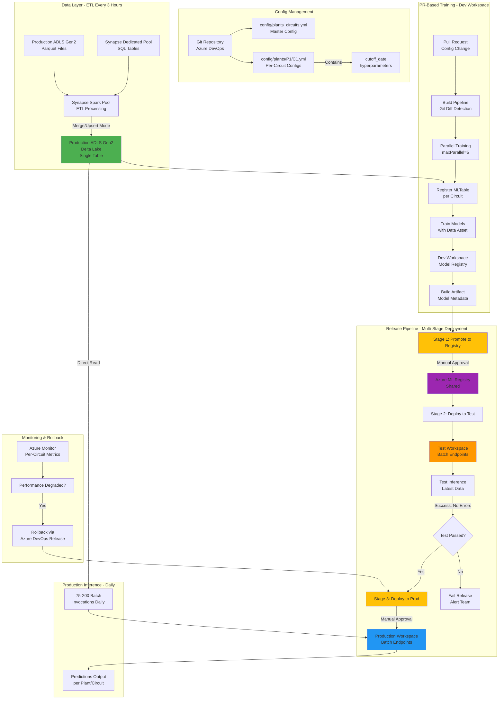

# High-Level Architecture

[← Back to README](../README.md)

---

## Architecture Overview

Production-ready Azure Machine Learning MLOps architecture for **75-200 time series forecasting models** with multi-stage deployment and approval gates.

### System Diagram



---

## Key Architectural Decisions

### 1. Multi-Workspace Strategy
- **Dev Workspace:** Training and experimentation
- **Shared Azure ML Registry:** Central model and environment store
- **Test Workspace:** Integration testing and validation
- **Production Workspace:** Production inference only

**Rationale:** Isolation between environments, shared registry for consistency, approval gates between stages.

### 2. Multi-Model Organization
- **Scale:** 75-200 models (5-10 circuits per plant × 15-20 plants)
- **Batch Endpoints:** One per plant (15-20 total)
- **Deployments:** One per circuit within plant (5-10 per endpoint)

**Rationale:** Logical grouping by plant, independent updates per circuit, simplified endpoint management.

### 3. Hybrid Data Strategy
- **Training:** MLTable Data Assets with date-based versions for reproducibility
- **Inference:** Direct Delta Lake reads for performance

**Rationale:** Training requires reproducibility (Data Assets), inference needs latest data (direct reads).

### 4. PR-Based Training Workflow
- **Trigger:** Git config file changes
- **Execution:** Parallel training (maxParallel=5)
- **Output:** Build artifact with model metadata

**Rationale:** Config-driven changes, automated training, controlled parallelism.

### 5. Three-Stage Release Pipeline
- **Stage 1:** Promote to Registry (manual approval + evidence)
- **Stage 2:** Deploy to Test (automated validation)
- **Stage 3:** Deploy to Production (manual approval)

**Rationale:** Approval gates, automated testing, audit trail, rollback capability.

---

## Azure Resources

### Core Services

| Service | Purpose | SKU |
|---------|---------|-----|
| Azure ML Registry | Shared model/environment registry | Enterprise |
| Azure ML Workspaces (3) | Dev, Test, Production | Enterprise Edition |
| ADLS Gen2 | Delta Lake storage | Standard LRS |
| Synapse Analytics | ETL processing (every 3 hours) | Spark Pool (Small) |
| Azure DevOps | CI/CD pipelines | Free tier |
| Azure Monitor | Alerting and metrics | Standard |

### Compute Resources

| Resource | Configuration | Purpose |
|----------|--------------|---------|
| Dev Compute Cluster | DS3_v2, 0-4 nodes | Training (parallel) |
| Test Compute Cluster | DS2_v2, 0-2 nodes | Test inference |
| Prod Compute Cluster | DS3_v2, 0-4 nodes | Production inference |

---

## Data Flow

### Training Flow
```
Config Change (PR) 
  → Git Diff Detection 
  → Register MLTable (per circuit, date-based version)
  → Parallel Training (maxParallel=5)
  → Model Registration (Dev Workspace)
  → Build Artifact Creation
```

### Deployment Flow
```
Build Artifact
  → Stage 1: Promote to Registry (manual approval)
  → Stage 2: Deploy to Test + Validate
  → Stage 3: Deploy to Production (manual approval)
```

### Inference Flow
```
ETL (every 3 hours) 
  → Delta Lake Update
  → Daily Batch Inference (75-200 invocations)
  → Predictions per Plant/Circuit
```

---

## Approval Gates

### Registry Promotion
- **Approvers:** ML Engineers
- **Evidence Required:**
  - PR review
  - Interactive notebook showing scoring execution in Dev
  - Training logs and metrics
  - Data lineage confirmation
- **Timeout:** 24 hours

### Production Deployment
- **Approvers:** ML Engineers or Engineering Managers
- **Evidence Required:**
  - Successful test validation
  - No errors in test inference
  - Rollback plan documented
- **Timeout:** 24 hours

---

## Versioning Strategy

| Asset Type | Versioning Rule | Example | Notes |
|------------|----------------|---------|-------|
| **Models** | Integer (auto-increment) | `1`, `2`, `15` | Azure ML enforced |
| **Environments** | Semantic versioning | `1.5.0`, `2.0.0` | String versions supported |
| **Data Assets** | Date-based strings | `2025-12-09` | Self-documenting |
| **Configs** | Git SHA | `a1b2c3d4` | Source control |

---

## Rollback Strategy

- **Method:** Redeploy previous successful Azure DevOps Release
- **SLA:** 15-20 minutes
- **Scope:** Per-circuit or all deployments
- **Tracking:** Previous version tagged in deployment metadata

---

## Next Steps

- [Data Architecture Details →](02-data-architecture.md)
- [Multi-Model Strategy →](03-multi-model-strategy.md)
- [Implementation Checklist →](14-implementation-checklist.md)
