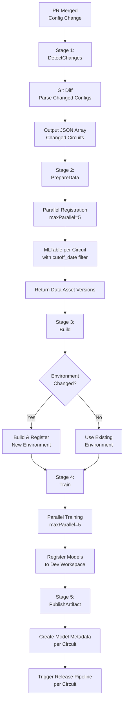

# Build Pipeline - PR-Based Training

[← Back to README](../README.md)

## Overview

The Build Pipeline implements PR-based training for the multi-model sensor prediction architecture. It automatically detects configuration changes via git diff and triggers parallel training for affected circuits, with a maximum of 5 concurrent training jobs.

## Table of Contents

1. [Pipeline Architecture](#pipeline-architecture)
2. [Pipeline Stages](#pipeline-stages)
3. [Stage 1: DetectChanges](#stage-1-detectchanges)
4. [Stage 2: PrepareData](#stage-2-preparedata)
5. [Stage 3: Build](#stage-3-build)
6. [Stage 4: Train](#stage-4-train)
7. [Stage 5: PublishArtifact](#stage-5-publishartifact)
8. [Parallel Execution Strategy](#parallel-execution-strategy)
9. [Pipeline Variables](#pipeline-variables)
10. [Manual Training Pipeline](#manual-training-pipeline)

---

## Pipeline Architecture



---

## Pipeline Stages

### Pipeline Configuration

```yaml
# azure-pipelines-build-training.yml
trigger:
  branches:
    include:
      - main
  paths:
    include:
      - config/plants/**/*.yml  # Trigger only on config changes

variables:
  - name: maxParallelTraining
    value: 5  # Limit concurrent training jobs
  - name: azuremlWorkspace
    value: 'dev-ml-workspace'
  - name: resourceGroup
    value: 'mlops-rg'
  - name: subscriptionId
    value: '$(AZURE_SUBSCRIPTION_ID)'

stages:
  - stage: DetectChanges
  - stage: PrepareData
  - stage: Build
  - stage: Train
  - stage: PublishArtifact
```

---

## Stage 1: DetectChanges

### Purpose

Analyze merged PR to identify which circuit configuration files changed and extract relevant parameters.

### Jobs

#### GitDiff Job

```yaml
- stage: DetectChanges
  displayName: 'Detect Changed Circuit Configs'
  jobs:
    - job: GitDiff
      displayName: 'Analyze Changed Config Files'
      steps:
        - checkout: self
          fetchDepth: 2  # Need current + previous commit
        
        - task: PythonScript@0
          name: detectChanges
          displayName: 'Parse changed configs and extract plant/circuit IDs'
          inputs:
            scriptSource: 'filePath'
            scriptPath: 'scripts/detect_config_changes.py'
            arguments: '--pr-number $(System.PullRequest.PullRequestNumber) --commit-sha $(Build.SourceVersion)'
          # Output: JSON file with [{plant_id, circuit_id, cutoff_date, config_path}, ...]
        
        - script: |
            # Set pipeline variable with changed circuits
            echo "##vso[task.setvariable variable=changedCircuits;isOutput=true]$(cat changed_circuits.json)"
          name: setChangedCircuits
          displayName: 'Export Changed Circuits to Pipeline Variable'
```

### detect_config_changes.py Script

```python
#!/usr/bin/env python3
"""
Detect which circuit config files changed in a PR and extract parameters.
"""

import argparse
import json
import yaml
import subprocess
from pathlib import Path


def detect_changed_configs(pr_number, commit_sha):
    """
    Parse git diff to find changed config files.
    
    Returns:
        list: [{plant_id, circuit_id, cutoff_date, config_path}, ...]
    """
    # Get list of changed files from git diff
    result = subprocess.run(
        ['git', 'diff', '--name-only', 'HEAD~1', 'HEAD'],
        capture_output=True,
        text=True
    )
    
    changed_files = result.stdout.strip().split('\n')
    
    # Filter for config files
    config_pattern = 'config/plants/'
    changed_configs = [
        f for f in changed_files 
        if f.startswith(config_pattern) and f.endswith('.yml')
    ]
    
    print(f"Found {len(changed_configs)} changed config files")
    
    # Parse each config file
    circuits = []
    for config_path in changed_configs:
        if not Path(config_path).exists():
            print(f"Warning: {config_path} not found, skipping")
            continue
        
        with open(config_path, 'r') as f:
            config = yaml.safe_load(f)
        
        circuit_info = {
            'plant_id': config['plant_id'],
            'circuit_id': config['circuit_id'],
            'cutoff_date': config['training']['cutoff_date'],
            'environment_version': config['training']['environment_version'],
            'config_path': config_path,
            'pr_number': pr_number,
            'commit_sha': commit_sha
        }
        
        circuits.append(circuit_info)
        print(f"  - {circuit_info['plant_id']}/{circuit_info['circuit_id']}")
    
    # Write to JSON file for pipeline consumption
    with open('changed_circuits.json', 'w') as f:
        json.dump(circuits, f, indent=2)
    
    print(f"\nTotal circuits to train: {len(circuits)}")
    return circuits


if __name__ == "__main__":
    parser = argparse.ArgumentParser()
    parser.add_argument('--pr-number', required=True, help='PR number')
    parser.add_argument('--commit-sha', required=True, help='Git commit SHA')
    
    args = parser.parse_args()
    
    circuits = detect_changed_configs(args.pr_number, args.commit_sha)
    
    # Create Azure DevOps matrix format
    matrix = {}
    for i, circuit in enumerate(circuits):
        matrix[f"Circuit_{i+1}"] = circuit
    
    with open('matrix.json', 'w') as f:
        json.dump(matrix, f)
    
    print(f"\nMatrix JSON created with {len(matrix)} entries")
```

### Output Format

```json
[
  {
    "plant_id": "P001",
    "circuit_id": "C001",
    "cutoff_date": "2025-12-09",
    "environment_version": "1.5.0",
    "config_path": "config/plants/P001/C001.yml",
    "pr_number": "1234",
    "commit_sha": "a1b2c3d4"
  },
  {
    "plant_id": "P001",
    "circuit_id": "C002",
    "cutoff_date": "2025-12-09",
    "environment_version": "1.5.0",
    "config_path": "config/plants/P001/C002.yml",
    "pr_number": "1234",
    "commit_sha": "a1b2c3d4"
  }
]
```

---

## Stage 2: PrepareData

### Purpose

Register MLTable Data Assets for each changed circuit in parallel, with a maximum of 5 concurrent registrations.

### Jobs

```yaml
- stage: PrepareData
  displayName: 'Register MLTable Data Assets'
  dependsOn: DetectChanges
  variables:
    changedCircuits: $[ stageDependencies.DetectChanges.GitDiff.outputs['setChangedCircuits.changedCircuits'] ]
  jobs:
    - job: RegisterMLTables
      displayName: 'Register MLTables in Parallel'
      strategy:
        maxParallel: $(maxParallelTraining)
        matrix: $[ variables.changedCircuits ]  # Dynamic matrix from detected changes
      steps:
        - task: AzureCLI@2
          name: registerMLTable
          displayName: 'Register MLTable for $(plant_id)/$(circuit_id)'
          inputs:
            azureSubscription: 'AzureML-ServiceConnection'
            scriptType: 'bash'
            scriptLocation: 'scriptPath'
            scriptPath: 'scripts/register_mltable.py'
            arguments: |
              --plant-id "$(plant_id)" \
              --circuit-id "$(circuit_id)" \
              --cutoff-date "$(cutoff_date)" \
              --pr-number "$(System.PullRequest.PullRequestNumber)" \
              --pr-author "$(Build.RequestedFor)" \
              --git-sha "$(Build.SourceVersion)" \
              --workspace-name "$(azuremlWorkspace)" \
              --resource-group "$(resourceGroup)" \
              --subscription-id "$(subscriptionId)"
        
        - script: |
            # Save Data Asset version for this circuit
            echo "##vso[task.setvariable variable=dataAssetVersion_$(plant_id)_$(circuit_id);isOutput=true]$(cat data_asset_version.txt)"
          name: setVersion
          displayName: 'Save Data Asset Version'
```

### MLTable Registration

**Key Features:**
- Checks if Data Asset with cutoff_date already exists
- Skips registration if found (avoids duplicates)
- Uses cutoff_date as version string (e.g., "2025-12-09")
- Returns version for pipeline consumption

**See:** [09-scripts-reference.md](09-scripts-reference.md#register_mltable.py) for full script

---

## Stage 3: Build

### Purpose

Check if environment changed in PR and build/register new version if needed.

### Jobs

```yaml
- stage: Build
  dependsOn: PrepareData
  jobs:
    - job: BuildEnvironment
      displayName: 'Build and Register Custom Environment'
      steps:
        - task: PythonScript@0
          displayName: 'Check if Environment Build Required'
          name: checkEnvChange
          inputs:
            scriptSource: 'filePath'
            scriptPath: 'scripts/check_env_change.py'
            arguments: '--pr-number $(System.PullRequest.PullRequestNumber)'
          # Output: env_changed=true/false, env_version, backward_compatible
        
        - task: AzureCLI@2
          displayName: 'Build and Register Environment to Dev Workspace'
          condition: eq(variables['checkEnvChange.env_changed'], 'true')
          name: buildEnv
          inputs:
            azureSubscription: 'AzureML-ServiceConnection'
            scriptType: 'bash'
            scriptLocation: 'inlineScript'
            inlineScript: |
              # Build source code package
              python setup.py sdist bdist_wheel
              
              # Register environment with semantic versioning
              ENV_VERSION=$(az ml environment create \
                --file environment/custom_tf_env.yml \
                --workspace-name "$(azuremlWorkspace)" \
                --resource-group "$(resourceGroup)" \
                --set tags.backward_compatible="$(checkEnvChange.backward_compatible)" \
                     tags.requires_retrain="$(checkEnvChange.requires_retrain)" \
                     tags.pr_number="$(System.PullRequest.PullRequestNumber)" \
                     tags.git_commit_sha="$(Build.SourceVersion)" \
                --query version -o tsv)
              
              echo "Environment version: $ENV_VERSION (semantic versioning)"
              echo "##vso[task.setvariable variable=envVersion;isOutput=true]$ENV_VERSION"
        
        - script: |
            # Use existing environment version if not changed
            if [ "$(checkEnvChange.env_changed)" == "false" ]; then
              ENV_VERSION=$(python scripts/get_env_from_config.py --config-file "config/plants/$(plant_id)/$(circuit_id).yml")
              echo "##vso[task.setvariable variable=envVersion;isOutput=true]$ENV_VERSION"
            fi
          displayName: 'Get Existing Environment Version'
          condition: eq(variables['checkEnvChange.env_changed'], 'false')
```

### check_env_change.py Script

```python
#!/usr/bin/env python3
"""
Check if environment files changed in PR.
"""

import argparse
import subprocess
import yaml


def check_environment_change(pr_number):
    """
    Check if environment-related files changed.
    
    Returns:
        dict: {env_changed, env_version, backward_compatible, requires_retrain}
    """
    # Get changed files
    result = subprocess.run(
        ['git', 'diff', '--name-only', 'HEAD~1', 'HEAD'],
        capture_output=True,
        text=True
    )
    
    changed_files = result.stdout.strip().split('\n')
    
    # Check if environment files changed
    env_files = [
        'environment/custom_tf_env.yml',
        'environment/conda.yml',
        'environment/requirements.txt',
        'src/',
        'setup.py'
    ]
    
    env_changed = any(
        any(f.startswith(pattern) for pattern in env_files)
        for f in changed_files
    )
    
    if env_changed:
        # Read environment config to get new version
        with open('environment/custom_tf_env.yml', 'r') as f:
            env_config = yaml.safe_load(f)
        
        env_version = env_config['version']
        backward_compatible = env_config.get('tags', {}).get('backward_compatible', 'true')
        requires_retrain = env_config.get('tags', {}).get('requires_retrain', 'false')
        
        print(f"Environment changed: version {env_version}")
        print(f"Backward compatible: {backward_compatible}")
        print(f"Requires retrain: {requires_retrain}")
        
        # Write outputs for pipeline
        print(f"##vso[task.setvariable variable=env_changed;isOutput=true]true")
        print(f"##vso[task.setvariable variable=env_version;isOutput=true]{env_version}")
        print(f"##vso[task.setvariable variable=backward_compatible;isOutput=true]{backward_compatible}")
        print(f"##vso[task.setvariable variable=requires_retrain;isOutput=true]{requires_retrain}")
    else:
        print("Environment not changed")
        print(f"##vso[task.setvariable variable=env_changed;isOutput=true]false")


if __name__ == "__main__":
    parser = argparse.ArgumentParser()
    parser.add_argument('--pr-number', required=True)
    args = parser.parse_args()
    
    check_environment_change(args.pr_number)
```

---

## Stage 4: Train

### Purpose

Train models in parallel for all changed circuits using registered Data Assets and fixed environment versions.

### Jobs

```yaml
- stage: Train
  displayName: 'Train Models in Parallel'
  dependsOn: [PrepareData, Build]
  variables:
    changedCircuits: $[ stageDependencies.DetectChanges.GitDiff.outputs['setChangedCircuits.changedCircuits'] ]
    envVersion: $[ stageDependencies.Build.BuildEnvironment.outputs['buildEnv.envVersion'] ]
  jobs:
    - job: TrainModels
      displayName: 'Train Circuit Models'
      strategy:
        maxParallel: $(maxParallelTraining)
        matrix: $[ variables.changedCircuits ]
      steps:
        - script: |
            # Retrieve Data Asset version and Environment version
            DATA_ASSET_VERSION=$[ stageDependencies.PrepareData.RegisterMLTables.outputs['setVersion.dataAssetVersion_$(plant_id)_$(circuit_id)'] ]
            ENV_VERSION="$(envVersion)"
            echo "Training $(plant_id)/$(circuit_id) with Data Asset: $DATA_ASSET_VERSION, Environment: $ENV_VERSION"
          displayName: 'Get Data Asset and Environment Versions'
        
        - task: AzureCLI@2
          displayName: 'Submit Training Job for $(plant_id)/$(circuit_id)'
          inputs:
            azureSubscription: 'AzureML-ServiceConnection'
            scriptType: 'bash'
            scriptLocation: 'inlineScript'
            inlineScript: |
              CONFIG_FILE="config/plants/$(plant_id)/$(circuit_id).yml"
              
              # Submit training with fixed Data Asset and Environment versions
              JOB_NAME=$(az ml job create \
                --file pipelines/training_pipeline.yml \
                --set inputs.training_data.path="azureml:sensor_training_data_$(plant_id)_$(circuit_id):$DATA_ASSET_VERSION" \
                --set inputs.plant_id="$(plant_id)" \
                --set inputs.circuit_id="$(circuit_id)" \
                --set inputs.config_file="$CONFIG_FILE" \
                --set environment="azureml:custom-tf-env:$(envVersion)" \
                --set display_name="Train_$(plant_id)_$(circuit_id)_PR$(System.PullRequest.PullRequestNumber)" \
                --workspace-name "$(azuremlWorkspace)" \
                --resource-group "$(resourceGroup)" \
                --query name -o tsv)
              
              echo "##vso[task.setvariable variable=jobName;isOutput=true]$JOB_NAME"
          name: submitJob
        
        - task: AzureCLI@2
          displayName: 'Wait for Training Completion'
          inputs:
            azureSubscription: 'AzureML-ServiceConnection'
            scriptType: 'bash'
            scriptLocation: 'inlineScript'
            inlineScript: |
              # Wait for job to complete
              az ml job stream \
                --name "$(submitJob.jobName)" \
                --workspace-name "$(azuremlWorkspace)" \
                --resource-group "$(resourceGroup)"
        
        - task: AzureCLI@2
          displayName: 'Register Model to Dev Workspace'
          name: registerModel
          inputs:
            azureSubscription: 'AzureML-ServiceConnection'
            scriptType: 'bash'
            scriptLocation: 'scriptPath'
            scriptPath: 'scripts/register_model.sh'
            arguments: |
              --plant-id "$(plant_id)" \
              --circuit-id "$(circuit_id)" \
              --pr-number "$(System.PullRequest.PullRequestNumber)" \
              --data-asset-version "$DATA_ASSET_VERSION" \
              --workspace-name "$(azuremlWorkspace)" \
              --job-name "$(submitJob.jobName)"
```

### Training Pipeline YAML

```yaml
# pipelines/training_pipeline.yml
$schema: https://azuremlschemas.azureedge.net/latest/pipelineJob.schema.json
type: pipeline
display_name: Train Sensor Model

inputs:
  training_data:
    type: mltable
  plant_id:
    type: string
  circuit_id:
    type: string
  config_file:
    type: string

jobs:
  train:
    type: command
    inputs:
      training_data: ${{parent.inputs.training_data}}
      plant_id: ${{parent.inputs.plant_id}}
      circuit_id: ${{parent.inputs.circuit_id}}
      config_file: ${{parent.inputs.config_file}}
    outputs:
      model_output:
        type: mlflow_model
    code: ./src
    environment: azureml:custom-tf-env@latest
    command: >-
      python train.py
      --training-data ${{inputs.training_data}}
      --plant-id ${{inputs.plant_id}}
      --circuit-id ${{inputs.circuit_id}}
      --config-file ${{inputs.config_file}}
      --model-output ${{outputs.model_output}}
    compute: azureml:cpu-cluster
```

---

## Stage 5: PublishArtifact

### Purpose

Create model metadata artifacts for Release Pipeline consumption (one per circuit).

### Jobs

```yaml
- stage: PublishArtifact
  displayName: 'Publish Model Artifacts'
  dependsOn: Train
  jobs:
    - job: CreateArtifacts
      strategy:
        matrix: $[ variables.changedCircuits ]
      steps:
        - script: |
            # Create artifact metadata for Release Pipeline
            cat > model_artifact_$(plant_id)_$(circuit_id).json <<EOF
            {
              "plant_id": "$(plant_id)",
              "circuit_id": "$(circuit_id)",
              "model_name": "$(registerModel.modelName)",
              "model_version": "$(registerModel.modelVersion)",
              "environment_version": "$(envVersion)",
              "dev_workspace": "$(azuremlWorkspace)",
              "pr_number": "$(System.PullRequest.PullRequestNumber)",
              "build_id": "$(Build.BuildId)",
              "commit_sha": "$(Build.SourceVersion)",
              "trained_at": "$(date -u +%Y-%m-%dT%H:%M:%SZ)"
            }
            EOF
            
            echo "Artifact created: model_artifact_$(plant_id)_$(circuit_id).json"
          displayName: 'Create Release Artifact Metadata'
        
        - task: PublishBuildArtifacts@1
          displayName: 'Publish Model Artifact for Release'
          inputs:
            PathtoPublish: 'model_artifact_$(plant_id)_$(circuit_id).json'
            ArtifactName: 'model-$(plant_id)-$(circuit_id)'
            publishLocation: 'Container'
```

### Artifact Format

```json
{
  "plant_id": "P001",
  "circuit_id": "C001",
  "model_name": "sensor_model",
  "model_version": "5",
  "environment_version": "1.5.0",
  "dev_workspace": "dev-ml-workspace",
  "pr_number": "1234",
  "build_id": "20251209.1",
  "commit_sha": "a1b2c3d4e5f6",
  "trained_at": "2025-12-09T14:30:00Z"
}
```

---

## Parallel Execution Strategy

### maxParallel Configuration

**Value:** 5 concurrent jobs

**Rationale:**
- Prevents resource exhaustion on compute cluster (0-4 nodes)
- Balances throughput with stability
- Typical PRs change < 5 configs

### Resource Allocation

| Resource | Configuration | Concurrent Capacity |
|----------|--------------|---------------------|
| Compute Cluster | Auto-scale 0-4 nodes | 4 nodes max |
| Node Size | Standard_DS3_v2 (4 vCPU, 14GB RAM) | ~1 training per node |
| maxParallel | 5 | Maximum 5 jobs queued |
| Queue Behavior | FIFO | Remaining jobs wait |

### Execution Example

**PR changes 8 configs:**

```
Time 0s:  Start jobs 1-5 (circuits P001_C001, P001_C002, P001_C003, P002_C001, P002_C002)
Time 600s: Job 1 completes → Start job 6 (circuit P002_C003)
Time 750s: Job 2 completes → Start job 7 (circuit P003_C001)
Time 900s: Job 3 completes → Start job 8 (circuit P003_C002)
Time 1200s: All jobs complete
```

---

## Pipeline Variables

### Global Variables

```yaml
variables:
  - name: maxParallelTraining
    value: 5
  - name: azuremlWorkspace
    value: 'dev-ml-workspace'
  - name: resourceGroup
    value: 'mlops-rg'
  - name: subscriptionId
    value: '$(AZURE_SUBSCRIPTION_ID)'
```

### Variable Groups

```yaml
- group: azureml-variables
  # Contains:
  # - AZURE_SUBSCRIPTION_ID
  # - AZUREML_WORKSPACE_NAME
  # - RESOURCE_GROUP_NAME
```

### Stage Dependencies

| Variable | Source | Usage |
|----------|--------|-------|
| `changedCircuits` | DetectChanges stage | Matrix for parallel jobs |
| `dataAssetVersion_*` | PrepareData stage | Training input |
| `envVersion` | Build stage | Environment version |
| `jobName` | Train stage | Model registration |

---

## Manual Training Pipeline

### Overview

**Purpose:** Retrain specific circuits without PR (ad-hoc retraining)

**Trigger:** Manual execution with parameters

### Pipeline Configuration

```yaml
# azure-pipelines-manual-training.yml
trigger: none  # Manual trigger only

parameters:
  - name: plantId
    displayName: 'Plant ID'
    type: string
  - name: circuitId
    displayName: 'Circuit ID'
    type: string
  - name: cutoffDate
    displayName: 'Cutoff Date (YYYY-MM-DD) - leave empty to use config file'
    type: string
    default: ''

stages:
  - stage: PrepareData
    jobs:
      - job: RegisterMLTable
        steps:
          - script: |
              # Load cutoff_date from config if not provided
              if [ -z "${{ parameters.cutoffDate }}" ]; then
                CUTOFF_DATE=$(python scripts/read_config.py --plant-id "${{ parameters.plantId }}" --circuit-id "${{ parameters.circuitId }}" --field cutoff_date)
              else
                CUTOFF_DATE="${{ parameters.cutoffDate }}"
              fi
              echo "##vso[task.setvariable variable=cutoffDate;isOutput=true]$CUTOFF_DATE"
            name: setCutoffDate
            displayName: 'Determine Cutoff Date'
          
          - task: AzureCLI@2
            name: registerMLTable
            displayName: 'Register MLTable'
            inputs:
              azureSubscription: 'AzureML-ServiceConnection'
              scriptType: 'bash'
              scriptLocation: 'scriptPath'
              scriptPath: 'scripts/register_mltable.py'
              arguments: |
                --plant-id "${{ parameters.plantId }}" \
                --circuit-id "${{ parameters.circuitId }}" \
                --cutoff-date "$(cutoffDate)" \
                --pr-number "MANUAL" \
                --pr-author "$(Build.RequestedFor)" \
                --git-sha "$(Build.SourceVersion)"
  
  - stage: Train
    dependsOn: PrepareData
    jobs:
      - job: TrainModel
        steps:
          - task: AzureCLI@2
            displayName: 'Submit Training Job'
            inputs:
              azureSubscription: 'AzureML-ServiceConnection'
              scriptType: 'bash'
              scriptLocation: 'inlineScript'
              inlineScript: |
                CONFIG_FILE="config/plants/${{ parameters.plantId }}/${{ parameters.circuitId }}.yml"
                
                az ml job create \
                  --file pipelines/training_pipeline.yml \
                  --set inputs.training_data.path="azureml:sensor_training_data_${{ parameters.plantId }}_${{ parameters.circuitId }}:$(dataAssetVersion)" \
                  --set inputs.plant_id="${{ parameters.plantId }}" \
                  --set inputs.circuit_id="${{ parameters.circuitId }}" \
                  --set inputs.config_file="$CONFIG_FILE" \
                  --set display_name="ManualTrain_${{ parameters.plantId }}_${{ parameters.circuitId }}_$(Build.BuildId)"
```

---

## Related Documents

- [04-environment-management.md](04-environment-management.md) - Environment versioning
- [06-release-pipeline.md](06-release-pipeline.md) - Deployment stages
- [09-scripts-reference.md](09-scripts-reference.md) - Complete scripts
- [10-pipeline-yaml-reference.md](10-pipeline-yaml-reference.md) - Full YAML definitions

---

**Document Version:** 1.0  
**Last Updated:** December 9, 2025  
**Maintained By:** ML Engineering Team
